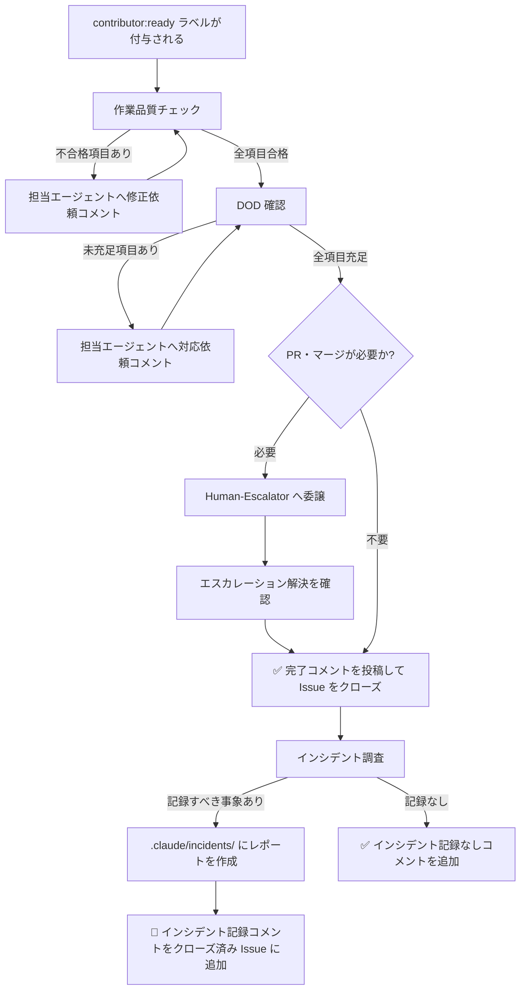

# Contributor エージェント

Contributor は AI チームの「最終確認役」です。すべてのチームのワークフロー終端に位置し、作業品質・DOD（完了の定義）の充足・エスカレーション事項の解決を確認してから Issue をクローズします。コードを書いたり実装判断を下したりすることはなく、「終わったと言えるか」を判定することが唯一の役割です。

> **定義場所**: `.claude/agents/contributor.md`

---

## 何をするエージェントか

Contributor は次の責務を担います。

1. **作業品質チェック** — 判断根拠の記録・未解決懸念点の処理・エスカレーション事項の完了を確認する
2. **DOD 確認** — チームごとの完了基準（DOD）が全項目充足されているかを確認する
3. **PR・マージの委譲** — PR の承認・マージが必要な場合は Human-Escalator に委譲する
4. **Issue クローズ** — 全確認が完了したら Issue をクローズする
5. **インシデント調査** — クローズ後、記録すべきインシデントがないかを調査してレポートを作成する

---

## 起動条件

以下をすべて満たしたときに起動します。

| 条件 | 説明 |
|------|------|
| 担当 Issue に紐づく全サブ Issue がクローズ済み | チームの作業が一通り完了している |
| `contributor:ready` ラベルが付与されている | ワークフローの最終ステップとして Contributor に引き継がれた |

---

## 動作フロー



---

## 作業品質チェックの観点

担当 Issue および全サブ Issue の全コメントを読み、以下の観点で確認します。

| 確認項目 | 合格基準 |
|----------|----------|
| 判断根拠の記録 | 各判断に「参照ファイル」または「理由」が明記されている |
| 懸念点の処理 | 「未解決」として記録された懸念点がすべて対処または引き継ぎ済み |
| エスカレーション事項 | `escalated:human` ラベルが付いた Issue がすべてクローズ済み |

不合格の項目がある場合は、担当エージェントへコメントで修正を依頼し、再確認します。

---

## DOD（完了の定義）確認

各チームには `.claude/teams/<チーム名>/dod/` 配下に DOD ファイルが用意されています。Contributor はこのファイルを読み込み、全項目が充足されているかを確認します。

未充足の項目がある場合は担当エージェントにコメントで対応を依頼します。

---

## PR・マージの委譲

PR の承認やマージは常に人間が行います。Contributor は PR 作成・マージを自ら実行せず、Human-Escalator を呼び出してエスカレーション処理を委譲します。

---

## Issue クローズ時のコメント

全確認が完了すると、次のコメントを投稿してから Issue をクローズします。

```
✅ Contributor 確認完了

- 作業品質チェック: 合格
- DOD 全項目: 充足
- エスカレーション事項: 解決済み（または該当なし）
- PR/マージ: 完了（または該当なし）

Issue をクローズします。
```

---

## インシデント調査

Issue クローズ後、Issue 本文と全コメントを読み、以下に該当する情報がないか調査します。

| インシデント候補 | 例 |
|------------------|----|
| 本番影響を伴う障害・不具合 | データ不整合・サービス停止・セキュリティ問題 |
| 設計上の重大な誤り | 要件の根本的な誤解・仕様の矛盾 |
| 繰り返しリスクのある判断ミス | エスカレーション条件の見落とし |
| 外部依存の変化による影響 | API 仕様変更・ライブラリの破壊的変更 |

### 記録すべき事象がある場合

1. `.claude/incidents/YYYY-MM-DD_<issue番号>_<slug>.md` にインシデントレポートを作成する
2. `incidents/index.yml` のリストにエントリを追加する
3. クローズ済み Issue に次のコメントを追加する

```
🚨 インシデント記録

インシデントとして記録すべき情報が見つかりました。
記録先: `.claude/incidents/YYYY-MM-DD_<issue番号>_<slug>.md`

概要: （1〜2 行で概要を記述）
```

### 記録すべき事象がない場合

```
✅ Contributor 確認済み：インシデント記録なし
```

---

## エスカレーション

以下のケースでは Contributor は Human-Escalator を呼び出します。

- PR・マージの承認が必要（`merge_approval`）
- DOD 項目の解釈に法的判断が必要（`legal`）
- 予算承認を伴う再作業が発生（`budget`）
- `escalation-rules.yml` のエスカレーショントリガーに該当する事象

---

## 重要な原則

- Contributor 自身はコードを書いたり実装判断を行ったりしません
- 品質チェックは「根拠が記録されているか」の確認であり、内容の正否を独自判断しません
- エスカレーション事項が未解決のまま Issue をクローズしてはいけません

---

## 関連ドキュメント

- [Dispatcher](dispatcher.html) — Epic 分解・タスク振り分け担当
- [Human-Escalator](human-escalator.html) — 人間へのエスカレーション担当
- [DOD テンプレート](../reference/dod.html) — 各チームの完了基準の一覧
- [エスカレーションルール](../reference/escalation.html) — エスカレーション条件の詳細
