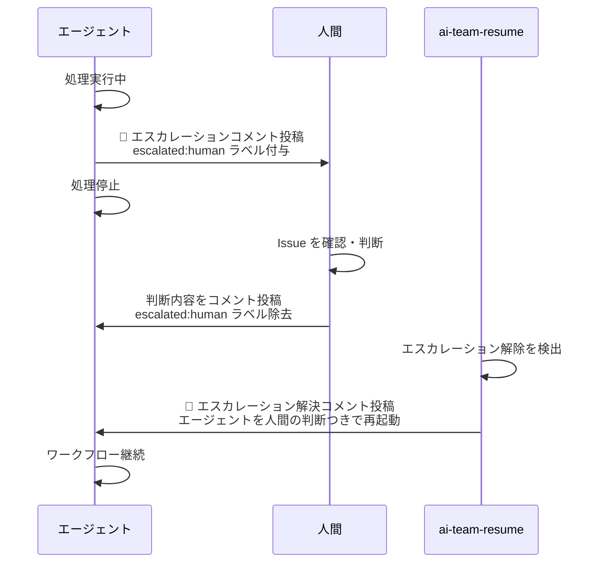

# /ai-team-resume — エスカレーション後の再開

人間がエスカレーション対応を完了した Issue を自動検出し、ワークフローの続きを再開します。Issue 番号の指定は通常不要です。

> **スキル定義**: `skills/ai-team-resume.md`

---

## 使い方

```
/ai-team-resume                  # 自動検出
/ai-team-resume <Issue番号>       # 特定 Issue を指定
/ai-team-resume <Issue URL>       # URL でも可
```

引数なしで実行すると、再開待ちの Issue を自動検出します。引数があった場合はその Issue を直接調査してステップ 4 へ進みます。

---

## ステップ 1: 再開対象 Issue の検索（引数なしの場合）

以下の条件を満たす Issue を検索します。

| 条件 | 説明 |
|------|------|
| オープン状態 | `state: open` |
| `escalated:human` ラベルなし | 人間がラベルを外している |
| `🚨 エスカレーション` を含むコメントが履歴にある | 過去にエスカレーションされた |
| そのコメント以降に AI 以外のコメントがある | 人間が返答している |

```bash
# Issue 一覧取得
gh issue list --state open --json number,title,labels,url

# 各 Issue のコメント確認
gh issue view <番号> --json comments
```

AI エージェントのコメントは絵文字（`🚨`・`✅`・`🛠️`・`🔧`・`🎨`・`💻`）で始まる規約のため、これらで始まらないコメントは人間の発言と判定します。

---

## ステップ 2: 対象 Issue が見つからない場合

次の案内を表示して終了します。

```
ℹ️  再開待ちのIssueは見つかりませんでした。

エスカレーション済みIssueを再開するには：
1. 該当IssueにコメントでAIへの指示を記録してください
2. escalated:human ラベルを外してください
3. 再度 /ai-team-resume を実行してください
```

---

## ステップ 3: 対象 Issue が複数ある場合

候補 Issue の一覧をユーザーに提示し、再開する Issue 番号の入力を求めます。入力された Issue 番号でステップ 4 に進みます。

---

## ステップ 4: 再開対象 Issue の状態確認

対象 Issue のコメント履歴を全件読み込み、以下を確認します。

```bash
gh issue view <番号> --json title,body,labels,comments
```

| 確認項目 | 参照先 |
|---------|--------|
| どのエージェントのどのステップで停止したか | エスカレーションコメント（`🚨 エスカレーション`）の直前のコメント |
| エスカレーション理由 | `🚨 エスカレーション` コメントの「エスカレーション理由」セクション |
| 人間の判断内容 | エスカレーションコメント以降の人間コメント |
| 再開すべき次のステップ | ワークフロー定義の `on_escalation.next` または停止したステップの `on_complete.next` |

---

## ステップ 5: 再開コメントの投稿

再開時に以下のコメントを投稿します。

```
🔄 エスカレーション解決 — ワークフローを再開します

## 人間の判断
（人間のコメント内容を引用または要約）

## 採用する方針
（決定した方針と根拠）

## 再開ステップ
（再開するエージェント名とステップ名）
```

---

## ステップ 6: ワークフローの再開

担当チームのワークフロー定義から再開ステップを特定し、対応するエージェント定義を読み込んで動作を再開します。

```
.claude/teams/<チーム>/workflow.yml の再開ステップ
→ .claude/teams/<チーム>/agents/<エージェント>.md を読み込む
→ 人間の判断をコンテキストとして持ちつつエージェントとして動作
```

人間の判断内容はエージェントの実行コンテキストに含まれるため、再度同じ箇所でエスカレーションすることを防げます。

---

## ソロモードでの自動再開

`/ai-team-watch` を実行している場合、エスカレーション解除済み Issue は監視ループの「再開処理 B」で自動検出されます。手動で `/ai-team-resume` を実行する必要はありません。

詳細は [ai-team-watch スキル](watch.html) を参照してください。

---

## エスカレーションのライフサイクル



---

## 関連ドキュメント

- [エスカレーションルール](../reference/escalation.html) — エスカレーション条件の詳細
- [ai-team-watch](watch.html) — ソロモードでの自動再開
- [ai-team-run](run.html) — 通常のワークフロー起動
