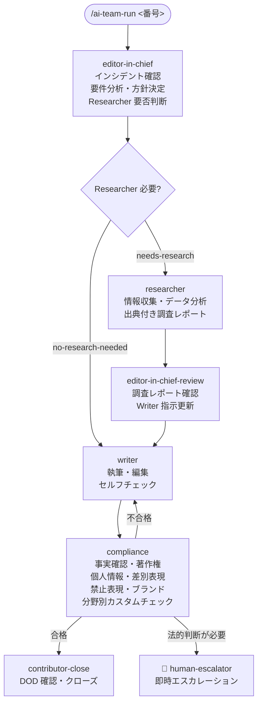

# コンテンツチーム

コンテンツチームは、記事・ドキュメント・コンテンツ作成を担当する AI チームです。Editor-in-Chief が記事ごとに「調査の要否」を判断し、必要なときだけ Researcher を起動するのが特徴です。PR 作成エージェントはなく、Compliance のチェック後に直接 Contributor へ引き継がれます。

> **ワークフロー定義**: `.claude/teams/content/workflow.yml`
> **エージェント定義**: `.claude/teams/content/agents/*.md`
> **DOD テンプレート**: `.claude/teams/content/dod/*.md`
> **コンプライアンスルール**: `.claude/teams/content/compliance-rules/*.md`

---

## エージェント一覧

| エージェント | 役割 | ラベル | 起動 |
|------------|------|--------|------|
| `editor-in-chief` | 編集長（リーダー）。方針決定・進行管理・Researcher 要否判断 | `content:editor-in-chief` | 自律 |
| `researcher` | 情報収集・データ分析の専門家 | `content:researcher` | **依頼時のみ** |
| `writer` | 執筆担当 | `content:writer` | 自律 |
| `compliance` | コンプライアンス・校正担当 | `content:compliance` | 自律 |

---

## ワークフロー全体フロー

法的判断が必要な場合（著作権・個人情報・名誉毀損リスク等）、Compliance は差し戻しではなく**即座に Human-Escalator を呼び出します**。

---

## Editor-in-Chief による Researcher 要否判断

`workflow.yml` の `editor-in-chief-planning` ステップに `conditions` で分岐が定義されています。

### Researcher が必要と判断する条件（`needs-research`）

- 統計・数値データが必要
- 専門的な事実確認が必要
- 情報源の裏付けが必要
- 調査レポートなしに正確な記事が書けないと判断

### Researcher が不要と判断する条件（`no-research-needed`）

- 内部ドキュメントの整理・編集
- ガイドライン・マニュアルの作成
- 既知の事実のみで構成される記事

Researcher の起動後は、Editor-in-Chief が調査レポートを確認し（`editor-in-chief-review` ステップ）、Writer への指示を更新してから引き継ぎます。

---

## Researcher の調査レポート

Researcher は事実と推定を明確に区別し、すべての情報に出典（URL・発行年・著者・機関名）を記録します。

### 情報源の優先順位

| 優先度 | 情報源 | 信頼性 |
|--------|--------|--------|
| 最優先 | 学術論文・査読付き研究 | 最高 |
| 優先 | 政府・公的機関の統計・報告書 | 高 |
| 通常 | 業界団体・信頼できる報道機関 | 中〜高 |
| 補助 | 専門家ブログ・業界レポート | 中 |

### 出力レポートのセクション

- 調査概要（テーマ・期間・範囲）
- 確認された事実（出典付き）
- 推定・見解（「推定」「見解」と明記）
- データ・統計（表形式）
- 注意事項・情報の限界
- Writer への申し送り

---

## Compliance のチェック項目

Compliance は 7 観点でチェックを実施します。

| 観点 | 基準 |
|------|------|
| 事実確認 | 記述された事実が参照元で確認できるか |
| 著作権 | 引用・転載が適切に処理されているか |
| 個人情報 | 個人を特定できる情報が含まれていないか |
| 差別的表現 | 差別・偏見につながる表現がないか |
| 誇大表現 | 根拠のない誇大表現・保証がないか |
| ブランド整合 | ブランドガイドラインに従っているか |
| 禁止表現 | Editor-in-Chief が指定した禁止表現が含まれていないか |

### 分野別カスタムチェック

`.claude/teams/content/compliance-rules/` 配下のルールが分野別に適用されます。

| ファイル | 適用分野 |
|---------|---------|
| `health-pharma.md` | 健康・医薬品関連の記事（薬機法・景表法等） |

プロジェクトに応じて新規ルールを追加できます（例: 金融・教育・法律分野）。

### 即時エスカレーション条件

以下に該当した場合、差し戻しではなく**即座に Human-Escalator を呼び出します**。

- 著作権侵害・個人情報漏洩リスク等の法的判断
- ブランドガイドラインに記述がなく判断できない表現

---

## DOD（Definition of Done）

| ファイル | 用途 | 主なチェック項目 |
|---------|------|---------------|
| `dod/article.md` | 新規記事作成 | 方針コメント・Researcher 要否・Compliance 合格・分野別カスタムチェック |
| `dod/document.md` | ドキュメント作成 | 仕様書・マニュアルの完成度・構成・正確性 |
| `dod/revision.md` | 既存コンテンツの修正・加筆 | 修正箇所明記・差分内容・整合性確認 |

---

## ステップ定義詳細（workflow.yml より）

| step id | agent | label | 概要 |
|---------|-------|-------|------|
| `editor-in-chief-planning` | editor-in-chief | `content:editor-in-chief` | 要件分析・方針決定・Researcher 要否を `conditions` で分岐 |
| `researcher` | researcher | `content:researcher` | 調査レポート作成（依頼時のみ） |
| `editor-in-chief-review` | editor-in-chief | `content:editor-in-chief` | 調査レポート確認・Writer 指示更新 |
| `writer` | writer | `content:writer` | 執筆・セルフチェック |
| `compliance` | compliance | `content:compliance` | コンプライアンスチェック |
| `human-escalator` | human-escalator | `escalated:human` | エスカレーション |
| `contributor-close` | contributor | `contributor:ready` | DOD 確認・クローズ |

`workflow.yml` の `editor-in-chief-planning` ステップでは、`on_complete` が `conditions` ではなく単独で記述されている点に注意してください（実際の YAML では `on_complete.conditions:` として記述）。

---

## 関連ドキュメント

- [チーム概要](overview.html) — 全チームの比較
- [ワークフロー定義](../reference/workflow.html) — workflow.yml の文法
- [DOD テンプレート](../reference/dod.html) — DOD の運用ルール
- [エスカレーションルール](../reference/escalation.html) — Compliance の即時エスカレーション
