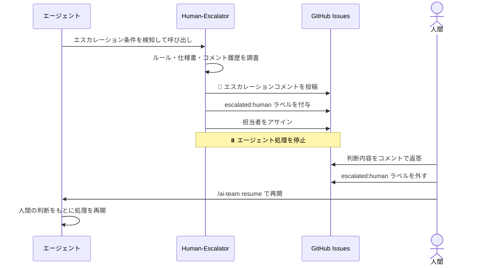

# Human-Escalator エージェント

Human-Escalator は、AI エージェントが「判断できない・判断してはいけない」事項が発生したときに起動し、人間への適切な引き継ぎを行う専門エージェントです。エスカレーションコメントを投稿して処理を停止し、人間が判断を下してからワークフローが再開されます。

> **定義場所**: `.claude/agents/human-escalator.md`

---

## 何をするエージェントか

Human-Escalator は次の 2 つのことを行います。

1. **エスカレーションコメントの投稿** — 何が判断できないか・どんな選択肢があるかを人間に伝えるコメントを Issue に投稿する
2. **処理の停止** — `escalated:human` ラベルを付与して、人間が返答するまでエージェント処理を止める

Human-Escalator 自身は判断を下しません。エスカレーションの理由と選択肢を提示することが唯一の役割です。

---

## 起動条件

他のエージェントが次の 4 種類のエスカレーショントリガーに該当する事象を検知したときに呼び出されます。

| 種別 | 具体例 |
|------|--------|
| `legal` | 利用規約・ライセンス・個人情報・契約に関わる判断 |
| `budget` | 費用が発生するサービス利用・予算承認を必要とする作業 |
| `merge_approval` | プルリクエストの承認・main ブランチへのマージ |
| `ambiguous_spec` | ルール・仕様書・CLAUDE.md に記述がなく、どちらを採用しても優劣がつかない場合 |

---

## 動作フロー



---

## エスカレーションコメントの形式

対象 Issue に次のフォーマットでコメントが投稿されます。v0.11.0 から `エスカレーション元ステップ` / `エスカレーション種別` / `人間への質問` / `選択肢と推奨` の**構造化フィールドが必須**になりました。

```
🚨 エスカレーション: 人間の判断が必要です

## エスカレーション理由

エスカレーション元ステップ: <workflow.yml のステップID（例: implementer）>
エスカレーション種別: <legal / budget / merge_approval / ambiguous_spec>
理由: （具体的に何が判断できないかを記述）

## 調査済みのドキュメント

- `.claude/rules/xxx.md` → 該当記述なし
- `CLAUDE.md` → 該当記述なし
- `docs/xxx.md` → 該当記述なし

## 判断が必要な選択肢

人間への質問: （Yes/No か選択式で答えられる形の質問）

選択肢と推奨:
- **選択肢A**: （内容と想定される影響）
- **選択肢B**: （内容と想定される影響）
- **推奨**: （推奨する選択肢とその理由）

→ このIssueにコメントで判断を返してください
⏸️ 人間の返答があるまでエージェント処理は停止します

## 対応完了後の手順

1. このIssueに判断内容をコメントしてください
2. `escalated:human` ラベルを外してください
3. 以下のコマンドでワークフローを再開してください：
   /ai-team resume
   （ソロモードの場合は自動で再開されます）
```

`エスカレーション元ステップ` と `エスカレーション種別` は、ワークフロー再開時（`/ai-team resume`）に `return_to_previous` の復帰先ステップを機械的に決定するために読み取られます。`エスカレーション元ステップ` には workflow.yml に実在するステップ ID をそのまま記載します（自由記述は禁止）。

---

## 調査の手順

エスカレーションコメントを投稿する前に、Human-Escalator は次のドキュメントを確認して「調査したが判断基準が見つからなかった」という証跡を残します。

- `.claude/rules/` 配下の全 `.md` ファイル
- `CLAUDE.md`
- `docs/` 配下の仕様書
- 関連 Issue のコメント履歴

調査結果はエスカレーションコメントの「調査済みのドキュメント」セクションに列挙されます。

---

## 処理停止とラベル管理

エスカレーションコメント投稿後、Human-Escalator は次の操作を行ってから処理を停止します。

| 操作 | 説明 |
|------|------|
| `escalated:human` ラベルの付与 | Issue がエスカレーション中であることを示す |
| 担当者のアサイン | プロジェクト設定に従い、判断を担当する人間をアサインする |

---

## 人間が無応答の場合のリマインド（v0.11.0）

人間からの返答がない場合も、即時のリマインドは行いません。

1. 次回の `/ai-team watch` または `/ai-team resume` 実行時に、最終エスカレーションコメントの投稿日時を確認する
2. 最終エスカレーションコメントから **48 時間以上**経過している場合のみ、リマインドコメントを **1 回だけ**投稿する
3. リマインド投稿後は追加のリマインドを行わず、人間の返答があるまで待機を継続する

```
⏰ リマインド: エスカレーションへの返答をお待ちしています

#<番号> のエスカレーション（<投稿日時>）にまだ返答がありません。
上記エスカレーションコメントの「人間への質問」にコメントで回答してください。

⏸️ 返答があるまでエージェント処理は停止したままです。
```

---

## 人間が対応した後の再開手順

1. Issue に判断内容をコメントする
2. `escalated:human` ラベルを手動で外す
3. `/ai-team resume` を実行してワークフローを再開する（ソロモードでは自動再開）

再開時は、エスカレーションコメントの `エスカレーション元ステップ` フィールドをもとに、workflow.yml の `return_to_previous` が指す復帰先ステップが機械的に決定されます。

---

## 重要な原則

- エスカレーション理由を曖昧にしてはいけません。「なぜ判断できないか」を具体的に記述します
- 調査したドキュメントをすべて列挙します（「調査したが見つからなかった」という証跡が重要）
- 人間の返答なしに処理を再開してはいけません
- エスカレーション内容は次のエージェントが参照できるよう Issue コメントに残します

---

## 関連ドキュメント

- [Dispatcher](dispatcher.html) — Epic 分解・タスク振り分け担当
- [Contributor](contributor.html) — 作業完了確認・Issue クローズ担当
- [エスカレーションルール](../reference/escalation.html) — エスカレーション条件と `escalation-rules.yml` の詳細
- [ワークフローガイド](../guide/workflow.html) — `/ai-team resume` の使い方を含む全体フロー
