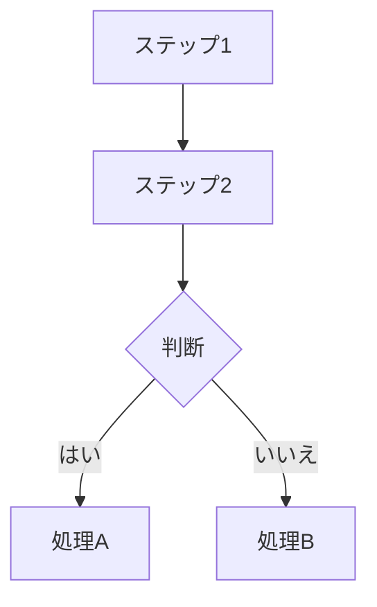

# ドキュメントの管理

@trimix/ai-team のドキュメントシステムは、Markdown で執筆してHTMLにビルドする2段階構成です。

## ディレクトリ構成

```
docs-src/          ← ここを編集する
├── build.js       ← ビルドスクリプト（編集不要）
├── config.json    ← ナビゲーション構成・バージョン設定
└── versions/
    ├── v0.5.0/   ← 旧バージョンのソース（変更しない）
    └── v0.5.1/   ← 現在のバージョンのソース

ai-team-manual/docs/       ← ビルドで自動生成（直接編集禁止）
└── v0.5.1/
    ├── index.html
    └── assets/
```

## ドキュメントの更新手順

### 1. Markdownを編集

`docs-src/versions/{バージョン}/` 配下のMarkdownファイルを編集します。

### 2. ビルドを実行

```bash
node docs-src/build.js
```

### 3. ブラウザで確認

`ai-team-manual/docs/index.html` をブラウザで開いて確認します。

### 4. コミット

```bash
git add docs-src/ ai-team-manual/
git commit -m "docs: v{バージョン} ドキュメントを更新"
```

## 新しいバージョンの追加

バージョンアップ時は以下の手順でドキュメントを追加します。

### 1. ソースディレクトリをコピー

```bash
cp -r docs-src/versions/v0.5.1 docs-src/versions/v0.6.0
```

### 2. config.json を更新

```json
{
  "versions": ["v0.5.1", "v0.6.0"],
  "latest": "v0.6.0"
}
```

### 3. 変更箇所を更新してビルド

```bash
node docs-src/build.js
```

## フローチャートの記述（Mermaid）

ドキュメント内のフローチャートや処理フロー図は **Mermaid記法** で記述します。HTMLビルド時に自動でレンダリングされます。

### 使い方

Markdownファイル内で ` ```mermaid ` コードブロックを使用します。



### 主な記法

| 記法 | 用途 |
|------|------|
| `flowchart TD` | 上から下へのフローチャート |
| `flowchart LR` | 左から右へのフローチャート |
| `sequenceDiagram` | シーケンス図（エージェント間の連携など） |

### ビルド時の動作

`node docs-src/build.js` 実行時に ` ```mermaid ` ブロックが `<div class="mermaid">` に変換されます。HTMLページはMermaid.js（CDN）を自動的に読み込み、ブラウザ上でレンダリングします。

## バージョン切り替え

ブラウザ上部の右側にあるバージョン切り替えドロップダウンで、異なるバージョンのドキュメントに切り替えられます。同じページが存在すれば、そのページを表示します。
