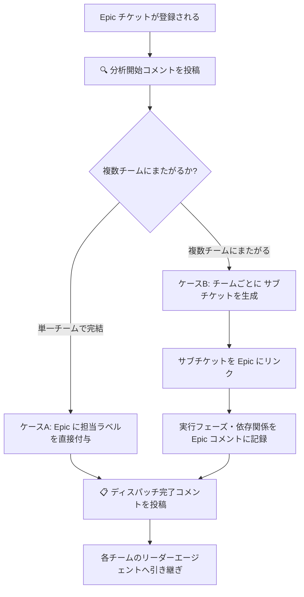
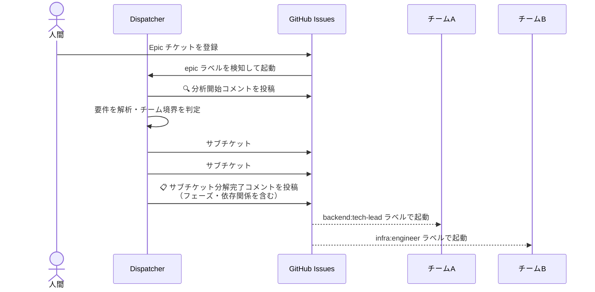

# Dispatcher エージェント

Dispatcher は、大きな作業要件（Epic チケット）を受け取り、各チームが実行できる単位のタスクに分解して割り当てる「仕事の振り分け役」です。このエージェントが動くことで、複雑な要件でも適切なチームへスムーズに引き継がれます。

> **定義場所**: `.claude/agents/dispatcher.md`

---

## 何をするエージェントか

Dispatcher は次の 2 つのことを行います。

1. **Epic の内容を読み解く** — チケットに書かれた要件を解析し、どのチームが関係するかを判断する
2. **タスクを振り分ける** — 単一チームで完結するならそのままディスパッチし、複数チームにまたがるなら サブチケットを生成して各チームへ割り当てる

実行計画（フェーズ・依存関係）は必ず Epic チケットのコメントとして記録されるため、**人間も含めた全員がどの順序で何が進んでいるかを把握**できます。

---

## 起動条件

| 条件 | 説明 |
|------|------|
| `epic` ラベル付き チケットの作成・更新 | 新しい Epic が登録されたとき |
| `dispatcher` ラベルの付与 | 既存 チケットを Dispatcher に再処理させたいとき |
| `dispatcher:run` ラベルの手動付与 | 人間や他のエージェントが明示的に起動を要求したとき |

---

## 動作フロー



---

## ケースA: 単一チームで完結する場合

作業がひとつのチームの範囲に収まる場合は、サブチケットを新たに作らず Epic チケット 本体に担当チームのラベルを付与して直接ディスパッチします。

**典型的な判断基準**

| チーム | 担当の目安 |
|--------|----------|
| バックエンドチーム（tech-lead） | コード実装・API 変更・テスト追加が主体 |
| コンテンツチーム（editor-in-chief） | ドキュメント・仕様書・コンテンツ作成が主体 |
| インフラチーム（infra-engineer） | インフラ構成・CI/CD・環境設定変更が主体 |

---

## ケースB: 複数チームにまたがる場合

作業が複数のチームに関わる場合は、チームごとに サブチケットを 1 件ずつ生成します。各 サブチケットには担当チームのラベルが付与され、対応するチームリーダーエージェントが自動的に起動します。

サブチケット 間に依存関係がある場合（例: インフラ設定が完了してからバックエンド実装を開始するなど）は、フェーズを分けた実行計画がコメントに記録されます。



---

## GitHub コメントの形式

### 分析開始時

Epic チケットに次のコメントが投稿されます。

```
🔍 Dispatcher: 分析を開始します

対象チケット: #<番号> <タイトル>
分析中のシステム領域: <フロントエンド / バックエンド / インフラ / ドキュメント 等>
```

### ケースA 完了時（単一チームへのディスパッチ）

```
📋 Dispatcher: 単一チームにディスパッチ完了

担当チーム: <チーム名>
担当リーダー: <リーダーエージェント名>
```

### ケースB 完了時（複数チームへの分解）

```
📋 Dispatcher: サブチケット分解完了

生成した サブチケット:
- #<番号> [tech-lead] <タイトル>
- #<番号> [infra-engineer] <タイトル>
- #<番号> [editor-in-chief] <タイトル>

実行フェーズ: <フェーズ数>
並列実行可能な サブチケット: <番号リスト>
依存関係あり（順序制約）: <番号 → 番号>
```

### 判断不能時（エスカレーション前）

```
⚠️ Dispatcher: 判断不能項目あり

以下の項目についてチームアサインの判断ができませんでした。
human-escalator を呼び出して人間に確認を求めます。

判断不能の理由:
- （理由を具体的に記述）
```

---

## エスカレーション

以下のケースでは Dispatcher は自分で判断せず、Human-Escalator を呼び出して人間に確認を求めます。

- Epic の要件が矛盾しており、分解方針を決定できない
- 既存のチームマッピングに該当しない新しい領域の作業が含まれる
- セキュリティや法的判断を伴うチームアサインが必要
- `escalation-rules.yml` のエスカレーショントリガーに該当する事象が発生した

---

## 重要な原則

- Dispatcher 自身はコードを書かず、実装判断も行いません
- サブチケットのタイトル・本文には、担当リーダーが作業を開始できる十分な情報が含まれます
- 依存関係を明確にせずに サブチケットを生成することはありません
- 1 つの サブチケットの担当チームは必ず 1 つです

---

## 関連ドキュメント

- [Contributor](contributor.html) — 作業完了確認・チケットクローズ担当
- [Human-Escalator](human-escalator.html) — 人間へのエスカレーション担当
- [エスカレーションルール](../reference/escalation.html) — エスカレーション条件の詳細
