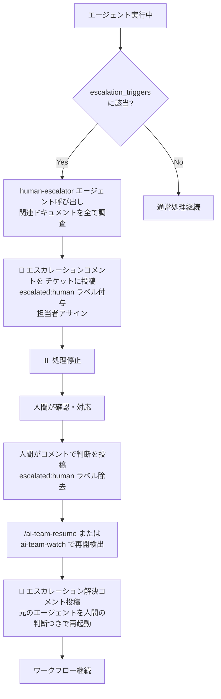

# エスカレーションルール

AI エージェントが判断できない・判断してはいけない事項に遭遇したとき、エージェントは自動的に `human-escalator` を呼び出して人間に判断を依頼します。このページではエスカレーションの仕組みと運用方法を解説します。

> **定義場所**:
> - エスカレーション条件: `.claude/escalation-rules.yml`
> - エスカレーターエージェント: `.claude/agents/human-escalator.md`

---

## エスカレーションの仕組み



---

## エスカレーション条件（`escalation_triggers`）

`.claude/escalation-rules.yml` で 4 種類定義されています。

> **v0.11.0 の変更**: 各トリガーに `id`（識別子）・`priority`（P1〜P3 の優先度）・`detection`（エスカレーションと判定するための具体手順）フィールドが追加され、エージェントは `detection` の手順どおりに確認してから判定します。主観的な判断のブレを防ぐ再現性強化の一環です。

### `legal` — 法的判断

```yaml
- id: legal
  type: legal
  priority: P1
  description: 法的判断、契約、コンプライアンスに関わる内容
  detection: |
    以下を順に確認し、1つでも該当すればエスカレーションと判定する:
      1. 利用規約・ライセンス・契約文書の作成・変更・解釈が含まれるか
      2. 個人情報・機密情報の取り扱い方針の新規決定・変更が必要か
      3. 外部サービス・ライブラリの規約/ライセンスの遵守可否の判断が必要か
```

**典型例**:
- 利用規約・ライセンス・契約条項の解釈
- 個人情報の取り扱い・GDPR・APPI
- 著作権・商標・特許
- 名誉毀損・侮辱罪リスク

**自動エスカレーションを行うエージェント**: tech-lead / implementer / reviewer / reviewer-a / reviewer-b / developer / writer / compliance / security-engineer / その他全エージェント

### `budget` — 予算承認

```yaml
- type: budget
  description: 予算承認、費用の発生を伴う判断
```

**典型例**:
- 有料 SaaS・API の契約
- サーバー・データベースの増強
- シークレット・API キーの新規発行・ローテーション
- 第三者ライブラリの商用ライセンス購入

### `merge_approval` — PR マージ承認

```yaml
- type: merge_approval
  description: プルリクエストの承認とマージは常に人間が行う
```

**典型例**: 全てのコードマージ。例外なく人間の判断が必要です。

**自動エスカレーションを行うエージェント**: pr-creator / human-merge-approval ステップ

### `ambiguous_spec` — 仕様の曖昧さ

```yaml
- type: ambiguous_spec
  description: |
    以下を全て検索して記述が見つからず、どちらを採用しても優劣がつかない場合:
      - .claude/rules/ 配下の .md ファイル
      - CLAUDE.md
      - docs/ 配下の仕様書
```

**典型例**:
- 設計方針が複数あり優劣がつかない
- レビュアー間で意見が一致しない
- 要件が矛盾している

---

## 透明性ルール（`transparency_rules`）

エージェントが守るべき透明性ルールです。

```yaml
transparency_rules:
  - 全ての判断には根拠を記録する
  - 参照したファイル・仕様書・ルールを明示する
  - 懸念点は「未解決」として明示する
  - 判断できなかった場合は理由を記録してエスカレーション
```

これらのルールにより、エスカレーションを受けた人間は「どこまで AI が調査し、何が判断できなかったか」を把握できます。

---

## `human-escalator` エージェントの動作

エスカレーションが必要と判断したエージェントは、`human-escalator` を呼び出します。

### ステップ 1: 調査内容の記録

エスカレーション前に以下を全て確認します。

- `.claude/rules/` 配下の全 `.md` ファイル
- `CLAUDE.md`
- `docs/` 配下の仕様書
- 関連する チケットのコメント履歴

### ステップ 2: エスカレーションコメントの投稿

v0.11.0 から、エスカレーションコメントには**機械可読の構造化フィールド**が含まれます。

```
🚨 エスカレーション: 人間の判断が必要です

## エスカレーション理由

エスカレーション元ステップ: <workflow.yml のステップID（例: implementer）>
エスカレーション種別: <legal / budget / merge_approval / ambiguous_spec>
理由: （具体的に何が判断できないかを記述）

## 調査済みのドキュメント

- `.claude/rules/xxx.md` → 該当記述なし
- `CLAUDE.md` → 該当記述なし
- `docs/xxx.md` → 該当記述なし

## 判断が必要な選択肢

人間への質問: （Yes/No か選択式で答えられる形の質問）

選択肢と推奨:
- **選択肢A**: （内容と想定される影響）
- **選択肢B**: （内容と想定される影響）
- **推奨**: （推奨する選択肢とその理由）

## 次のアクション

このチケットにコメントで判断を返してください。
返答例: 「選択肢Aで進めてください」

⏸️ 人間の返答があるまでエージェント処理は停止します。

## 対応完了後の手順

1. このチケットに判断内容をコメントしてください
2. escalated:human ラベルを外してください
3. 以下のコマンドでワークフローを再開してください：
   /ai-team-resume
   （ソロモードの場合は自動で再開されます）
```

> **重要（再開時の復帰先決定）**: `エスカレーション元ステップ` と `エスカレーション種別` の 2 フィールドは、ワークフロー再開時（`/ai-team-resume`）に `return_to_previous` の復帰先ステップを**機械的に**決定するために読み取られます。`エスカレーション元ステップ` には workflow.yml に実在するステップ ID をそのまま記載します（自由記述は禁止）。

> **インシデント判定での利用（v0.15.0）**: `エスカレーション種別` フィールドは、Contributor のインシデント調査でも読み取られます。種別が `merge_approval`（PR 承認・マージの正規ゲート）のエスカレーションは、設計上すべての PR で必ず発生する正常なフローのためインシデント対象外とし、`legal` / `budget` / `ambiguous_spec` の真のエスカレーションのみをインシデント候補とします。詳細は [Contributor](../agents/contributor.html) の「インシデント判定基準」を参照してください。

### ステップ 3: ラベルとアサインの更新

```bash
gh issue edit <番号> --add-label "escalated:human"
gh issue edit <番号> --add-assignee "<GitHubユーザー名>"
```

### ステップ 4: 処理停止

エスカレーションコメント投稿・ラベル付与・アサイン完了後、処理を停止します。

---

## 人間が無応答の場合のリマインド（v0.11.0）

人間からの返答がない場合も、即時のリマインドは行いません。

1. 次回の `/ai-team-watch` または `/ai-team-resume` 実行時に、最終エスカレーションコメントの投稿日時を確認する
2. 最終エスカレーションコメントから **48 時間以上**経過している場合のみ、リマインドコメントを **1 回だけ**投稿する
3. リマインド投稿後は追加のリマインドを行わず、人間の返答があるまで待機を継続する

---

## 人間の対応手順

エスカレーションを受けた人間は次の手順で対応します。

1. **チケットを確認**: `🚨 エスカレーション` コメントから理由・選択肢を把握
2. **判断のコメント投稿**: 「選択肢 A で進めてください」「変更ファイル数 6 ですがダブルレビュー不要、シングルでお願いします」など、AI に対する明確な指示を記録
3. **ラベル除去**: `gh issue edit <番号> --remove-label "escalated:human"` または GitHub UI でラベルを外す
4. **再開**:
   - マルチユーザーモード: `/ai-team-resume` を実行
   - ソロモード: `/ai-team-watch` が自動検出（手動再開不要）

---

## エージェント別エスカレーション条件

各エージェント定義（`.claude/teams/<team_id>/agents/*.md` および `.claude/agents/*.md`）には、エスカレーション条件が個別に記載されています。

### バックエンドチーム

| エージェント | 主なエスカレーション条件 |
|------------|----------------------|
| Tech-Lead | 要件矛盾 / セキュリティ・法的判断 / 費用発生 |
| Implementer | セキュリティ・法的判断発見 / 実装不可能な設計 |
| Reviewer / Reviewer-A/B | セキュリティ脆弱性発見 / PR 承認 / レビュアー間の意見不一致 |
| Tech-Writer | build.js 失敗 / ドキュメントの法的判断 / 大規模改訂 |
| PR-Creator | PR 作成失敗 / コンフリクト発生 |

### フロントエンドチーム

| エージェント | 主なエスカレーション条件 |
|------------|----------------------|
| Designer | 著作権・商標侵害の可能性 / 要件矛盾 |
| Frontend-Lead | 要件矛盾 / セキュリティ判断 / 費用発生 |
| Developer | セキュリティ判断発見 / 実装不可能な設計 |
| Reviewer | XSS 等のセキュリティ脆弱性 / PR 承認 |

### インフラチーム

| エージェント | 主なエスカレーション条件 |
|------------|----------------------|
| Infra-Lead | 公式ドキュメント不在 / 本番停止伴う変更 / 予算承認 |
| Network-Engineer | 本番ネットワーク停止 / 公式ドキュメント不在 |
| Infra-Specialist | ダウンタイム伴う変更 / 大幅な費用増 |
| **Security-Engineer** | **重大セキュリティリスク発見（即時エスカレーション）** |

### コンテンツチーム

| エージェント | 主なエスカレーション条件 |
|------------|----------------------|
| Editor-in-Chief | 法的リスク疑い / ブランドガイドライン不在 |
| Researcher | 法的判断を要する分野 / 情報源信頼性低 |
| Writer | 法的リスク / 方針解釈の複数化 |
| **Compliance** | **法的判断必要（即時エスカレーション）** |

### 共通エージェント

| エージェント | 主なエスカレーション条件 |
|------------|----------------------|
| Dispatcher | Epic 要件矛盾 / 新領域でチーム振り分け不能 |
| Contributor | PR 承認 / DOD 解釈に法的判断 |

---

## エスカレーションの典型的なフロー例

### 例 1: 認証ロジック実装中に法的判断が必要になった

```
1. Implementer: 認証実装中に GDPR 対応が必要と気付く
2. Implementer → Human-Escalator 呼び出し
   - 種別: legal
   - 理由: GDPR 対応の有無で実装方針が変わる
3. Human-Escalator: チケットに 🚨 エスカレーション投稿 + escalated:human ラベル
4. 人間: 「日本居住ユーザーのみ対象なので GDPR 対応不要、APPI 準拠で実装」
5. 人間: escalated:human ラベル除去
6. /ai-team-resume → Implementer 再起動（人間の判断をコンテキストに含む）
7. Implementer: 続きを実装 → tech-lead-review-decision へ
```

### 例 2: PR マージ承認

```
1. PR-Creator: gh pr create 完了
2. PR-Creator → Human-Escalator（merge_approval）
3. チケットに 「⚠️ 承認・マージは人間が行います」コメント投稿
4. 人間: PR をレビューしてマージ
5. /ai-team-resume → Contributor 起動 → DOD 確認 → チケットクローズ
```

---

## 関連ドキュメント

- [設定ファイル](config.html) — `escalation-rules.yml` の全フィールド
- [ai-team-resume](../skills/resume.html) — 再開コマンド
- [ai-team-watch](../skills/watch.html) — ソロモードでの自動再開
