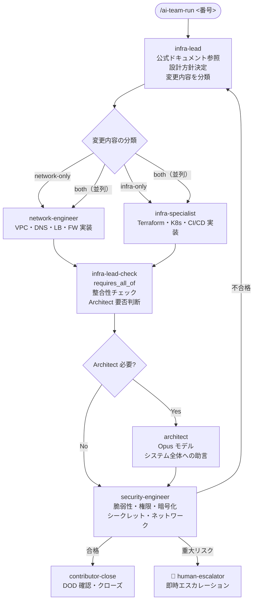

# インフラチーム

インフラチームは、ネットワーク・クラウド構成・セキュリティを担当する AI チームです。バックエンド・フロントエンドと異なり、PR 作成エージェントは存在せず、Security-Engineer によるレビュー後に直接 Contributor へ引き継がれます。

> **ワークフロー定義**: `.claude/teams/infra/workflow.yml`
> **エージェント定義**: `.claude/teams/infra/agents/*.md`
> **DOD テンプレート**: `.claude/teams/infra/dod/*.md`

---

## エージェント一覧

| エージェント | 役割 | ラベル | 起動 |
|------------|------|--------|------|
| `infra-lead` | リーダー。要件分析・設計方針決定・タスク振り分け | `infra:infra-lead` | 自律 |
| `network-engineer` | ネットワーク層（VPC・DNS・LB・FW 等）の実装 | `infra:network-engineer` | 自律 |
| `infra-specialist` | クラウド構成・Terraform・Kubernetes・CI/CD の実装 | `infra:infra-specialist` | 自律 |
| `security-engineer` | セキュリティレビュー | `infra:security-engineer` | 自律 |
| `architect` | システム全体への助言（Opus モデル使用） | `infra:architect` | **依頼時のみ** |

---

## ワークフロー全体フロー



重大セキュリティリスクが発見された場合、Security-Engineer は差し戻しではなく**即座に Human-Escalator を呼び出します**。

---

## Infra-Lead による変更内容の分類

Infra-Lead は変更内容を 3 つに分類して、適切な専門エージェントに振り分けます。

| 分類 | 条件 | 次ステップ |
|------|------|-----------|
| `network-only` | VPC・サブネット・DNS・LB・FW・ルーティングのみ | `network-engineer` |
| `infra-only` | Terraform・Kubernetes・CI/CD・環境設定のみ | `infra-specialist` |
| `both` | ネットワーク・クラウド構成の両方にまたがる | `[network-engineer, infra-specialist]`（並列実行） |

並列実行の場合、両者の完了を `infra-lead-check` ステップが `requires_all_of` で待ち合わせます。

---

## 公式ドキュメント参照の必須化

Infra-Lead・Network-Engineer・Infra-Specialist は、**実装前に必ず対象サービスの公式ドキュメントを参照**します。推測に基づく設定変更は禁止です。

各エージェントは設計方針・実装報告のコメントに「参照した公式ドキュメント」セクションを必ず含めます。

```
## 参照した公式ドキュメント
- AWS VPC: https://docs.aws.amazon.com/vpc/...（確認した設定項目: CIDR、サブネット分割）
- Terraform: https://registry.terraform.io/...（確認した設定項目: aws_subnet リソース）
```

このルールは `SuperClaude` フレームワーク（`~/.claude/MODE_Orchestration.md`）の「Infrastructure Configuration Validation」原則に対応しています。

---

## Architect エージェントの呼び出し

Architect は「依頼を受けた時のみ起動」する助言役です。Opus モデル（`claude-opus-4-7`）を使用するため、必要な場合のみ呼び出されます。

### 起動条件

- Infra-Lead が `infra:architect` ラベルを付与
- 人間が「Architect に確認してください」と チケットにコメント

### Architect が助言する領域

| 領域 | 具体例 |
|------|--------|
| インフラ設計 | クラウドアーキテクチャ・マイクロサービス・モノリス |
| プログラミング言語 | 言語選定・言語固有のベストプラクティス |
| デザインパターン | GoF・アーキテクチャパターン・DDD・CQRS |
| システム設計 | スケーラビリティ・可用性・一貫性のトレードオフ |
| データ設計 | DB 選定・スキーマ設計・データモデリング |
| セキュリティ設計 | 認証・認可・暗号化の設計方針 |
| パフォーマンス | ボトルネック分析・最適化方針 |
| 技術的負債 | リファクタリング戦略・移行計画 |

Architect は実装を行わず、**助言・方向性の提示のみ**を担当します。

---

## Security-Engineer のチェック項目

セキュリティレビューは 5 カテゴリで実施されます。

### 脆弱性チェック
- 既知の CVE
- 不要なポート公開
- セキュリティリスクのあるデフォルト設定

### 権限チェック
- 最小権限の原則
- IAM ロール・ポリシーの過剰権限
- 不必要な特権昇格

### 暗号化チェック
- TLS 1.2 以上の強制
- 保存データの暗号化
- 非推奨アルゴリズム（MD5・SHA-1・RC4）の不在

### シークレット管理チェック
- ハードコードの不在
- Vault / AWS Secrets Manager 等の使用
- ローテーション計画

### ネットワークチェック
- 必要ポートのみ開放
- 環境分離（本番・ステージング・開発）
- サービス間通信の認証・暗号化

**重大リスク発見時は差し戻しではなく即座に Human-Escalator を呼び出します。**

---

## DOD（Definition of Done）

| ファイル | 用途 | 主なチェック項目 |
|---------|------|---------------|
| `dod/infrastructure-change.md` | Terraform・K8s・CI/CD 変更 | 公式ドキュメント参照・IaC 更新・Security-Engineer 合格・ステージング検証・ロールバック手順 |
| `dod/network-change.md` | VPC・DNS・LB・FW 変更 | ネットワーク影響分析・疎通確認・最小公開原則 |
| `dod/security-review.md` | セキュリティ監査・脆弱性対応 | 5 カテゴリレビュー実施・重大度別整理・対応または別 チケット 化 |

---

## ステップ定義詳細（workflow.yml より）

| step id | agent | label | 概要 |
|---------|-------|-------|------|
| `infra-lead-analysis` | infra-lead | `infra:infra-lead` | 要件分析・公式ドキュメント参照・分類 |
| `network-engineer` | network-engineer | `infra:network-engineer` | ネットワーク層実装 |
| `infra-specialist` | infra-specialist | `infra:infra-specialist` | クラウド構成・IaC 実装 |
| `infra-lead-check` | infra-lead | `infra:infra-lead` | 整合性チェック（`requires_all_of`）・Architect 要否判断 |
| `architect` | architect | `infra:architect` | システム全体への助言（依頼時のみ） |
| `security-engineer` | security-engineer | `infra:security-engineer` | セキュリティレビュー |
| `human-escalator` | human-escalator | `escalated:human` | エスカレーション |
| `contributor-close` | contributor | `contributor:ready` | DOD 確認・クローズ |

---

## 関連ドキュメント

- [チーム概要](overview.html) — 全チームの比較
- [ワークフロー定義](../reference/workflow.html) — workflow.yml の文法
- [DOD テンプレート](../reference/dod.html) — DOD の運用ルール
- [エスカレーションルール](../reference/escalation.html) — Security-Engineer の即時エスカレーション
