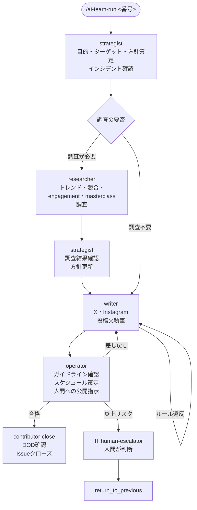

# SNS運用チーム

SNS運用チームは、X（Twitter）・Instagram の投稿戦略立案から執筆・公開指示までを自律的に行う AI チームです。トレンド調査・競合分析・masterclass セミナーの知見を投稿戦略に反映する仕組みが特徴です。

> **ワークフロー定義**: `.claude/teams/sns/workflow.yml`
> **エージェント定義**: `.claude/teams/sns/agents/*.md`
> **DOD テンプレート**: `.claude/teams/sns/dod/*.md`

---

## エージェント一覧

| エージェント | 役割の一言定義 | ラベル |
|------------|-------------|--------|
| `strategist` | 「何を・誰に・なぜ発信するか」を定義する | `sns:strategist` |
| `researcher` | 事実と数値に基づく調査レポートを作成する | `sns:researcher` |
| `writer` | 方針に従い X・Instagram 投稿文を作成する | `sns:writer` |
| `operator` | ガイドライン適合チェックと公開指示を作成する | `sns:operator` |

各エージェントは明確な責任範囲を持ち、**担当しないこと**を明示することで役割の重複を防いでいます。

---

## ワークフロー全体フロー

---

## 役割の境界線

各エージェントの責任範囲を明確にすることで、余計な判断の連鎖を防ぎます。

| 決定事項 | 担当エージェント |
|---------|--------------|
| 投稿目的・ターゲットの定義 | Strategist |
| 「何について書くか」の決定 | Strategist |
| 調査の要否判断 | Strategist |
| トレンド・競合・エンゲージメント・masterclass の調査 | Researcher |
| 調査結果の戦略への反映判断 | Strategist |
| X・Instagram 投稿文の執筆 | Writer |
| プラットフォームガイドライン適合の最終確認 | Operator |
| 投稿スケジュールの詳細策定 | Operator |
| 実際の投稿操作 | **人間**（Operator が指示を作成） |

---

## Researcher の起動条件

Researcher は Strategist が「調査が必要」と判断した場合のみ起動します。

**調査が必要な場合:**
- トレンド確認が必要（バイラルコンテンツ・ハッシュタグ動向）
- エンゲージメントデータ分析が必要
- masterclass 情報を反映したい
- 競合アカウント調査が必要

**調査不要な場合（Writer へ直行）:**
- 既存戦略に沿った定期投稿
- テキスト修正のみ
- 既知テーマの投稿

---

## Researcher の調査領域

| 調査カテゴリ | 内容 |
|------------|------|
| トレンド調査 | ハッシュタグ動向・バイラルコンテンツ傾向・時事トレンド |
| 競合分析 | 類似アカウントの投稿頻度・エンゲージメント率・人気投稿の傾向 |
| エンゲージメント分析 | 過去投稿のリーチ・いいね率・シェア率・フォロワー獲得傾向 |
| masterclass 分析 | 指定されたセミナー・コースからのベストプラクティス抽出 |

---

## Writer のプラットフォーム別執筆ルール

### X（Twitter）

| ルール | 基準 |
|-------|------|
| 文字数 | 140文字以内（日本語） |
| 冒頭フック | 1行目でスクロールを止める文言 |
| ハッシュタグ | 2〜3個・末尾に配置 |
| CTA | リプライ・リツイートを促す一言（任意） |

### Instagram

| ルール | 基準 |
|-------|------|
| キャプション冒頭 | 2行以内に核心メッセージ（「続きを読む」対策） |
| ハッシュタグ | 10〜20個・本文の下に改行で分離 |
| CTA | 末尾に必須（「保存してね」「コメントで教えて」等） |
| 画像説明 | キャプションに含める（アクセシビリティ対応） |

---

## Operator の公開指示

Operator は実際の投稿操作を行いません。人間が投稿操作を行うための明確な指示を作成します。

指示には以下が含まれます：
- 投稿文（Writer コメントへの参照）
- 推奨公開日時と理由
- 操作手順（ステップ形式）
- 投稿後 24 時間のモニタリング KPI

推奨投稿タイミングの参考基準：
- **X:** 平日 7〜9 時（通勤）、12〜13 時（昼休み）、19〜22 時（夜）
- **Instagram:** 平日 11〜13 時、18〜21 時、土日 9〜11 時

---

## DOD（Definition of Done）

| ファイル | 用途 | 主なチェック項目 |
|---------|------|---------------|
| `dod/post.md` | 単発投稿作成 | 戦略策定・投稿文作成・ガイドライン確認・公開指示 |
| `dod/campaign.md` | キャンペーン・連載企画 | 企画書・全投稿の一貫性・キャンペーンタグ統一・中間チェック |
| `dod/analysis.md` | 分析・改善レポート | KPI 収集・高低パフォーマンス分析・改善提案・次アクション |

---

## ステップ定義詳細（workflow.yml より）

| step id | agent | label | 概要 |
|---------|-------|-------|------|
| `strategist-planning` | strategist | `sns:strategist` | 目的・ターゲット・方針策定、調査要否の判断 |
| `researcher` | researcher | `sns:researcher` | トレンド・競合・エンゲージメント・masterclass 調査 |
| `strategist-review` | strategist | `sns:strategist` | 調査結果確認・方針更新（researcher 起動時のみ）。調査レポートが不十分な場合は `on_rework` で researcher へ差し戻し |
| `writer` | writer | `sns:writer` | X・Instagram 向け投稿文執筆 |
| `operator-review` | operator | `sns:operator` | ガイドライン確認・スケジュール策定・公開指示作成 |
| `human-escalator` | human-escalator | `escalated:human` | 炎上リスク・判断不能事項を人間にエスカレーション |
| `contributor-close` | contributor | `contributor:ready` | DOD 確認・Issue クローズ |

### 調査結果の品質ゲート（strategist-review の差し戻し）

`strategist-review` には `on_rework` が定義されており、Strategist が調査レポートを不十分（再調査が必要）と判定した場合は Researcher へ差し戻して再調査させます。差し戻し上限（`rework_limit: 2`）を超えた場合、すなわち同一 Issue で 3 回目の不合格となった場合は、Researcher へ差し戻さず `human-escalator` にエスカレーションします。不十分な調査結果のまま Writer の執筆工程へ進むことを防ぐための品質ゲートです。
