# YouTube動画制作チーム

YouTube動画制作チームは、チャンネルの立ち上げから動画の企画・台本・生成・公開・収益最大化までを一貫して行う AI チームです。台本を「最終動画のタイムライン」として扱う制作思想と、外部公開の前に必ず人間の承認を挟む安全設計が特徴です。ワークフロープラグイン（配布テンプレート）として提供され、`/ai-team-install youtube` で導入します。

> **ワークフロー定義**: `.claude/teams/youtube/workflow.yml`
> **エージェント定義**: `.claude/teams/youtube/agents/*.md`
> **制作憲法**: `.claude/teams/youtube/PRODUCTION-GUIDE.md`
> **DOD テンプレート**: `.claude/teams/youtube/dod/*.md`

---

## エージェント一覧

YouTube動画制作チームは 18 体のエージェントで構成されます。リーダーである `director` は自分では制作せず、タスク種別を判定して各専門エージェントに委譲します。`market-analyst` は v1.5.0 で新設された市場・ジャンル戦略エージェントで、`channel-producer` の上流に立ちます。v1.6.0 では、各制作工程の成果物を「作った本人とは別の目」で検証する **QA 層（品質ゲート）8 体**が追加されました。

### 制作エージェント（10 体）

| エージェント | 役割の一言定義 | ラベル |
|------------|-------------|--------|
| `director` | 統括リーダー。Issue を分析しタスク種別を 3 分岐判定し、各エージェントへ委譲する | `youtube:director` |
| `market-analyst` | 市場・ジャンル戦略担当。需要×競合の薄さ×CPM×ターゲット視聴国を横断スコアリングし「何を作るか」を上流でデータから提案する（最終決定は人間ゲート） | `youtube:market-analyst` |
| `channel-producer` | チャンネルの「箱」（趣旨・言語・字幕・配色・配信計画）と「編成」（トピック選定・重複防止・月次プラン）を担う | `youtube:channel-producer` |
| `scriptwriter` | 台本ライター。リサーチと執筆を担い、台本を最終動画のタイムラインとして仕上げる | `youtube:scriptwriter` |
| `editor` | 台本品質ゲートと動画生成（レンダ）＋自己検証を担う。情報を主・デザインを従とする | `youtube:editor` |
| `growth-strategist` | グロース担当。CTR タイトル・サムネ・タグ・章設計・視聴維持の「見てもらう」設計を行う | `youtube:growth-strategist` |
| `affiliate` | アフィリエイト各社の選定・説明欄リンク生成・開示文（FTC／景表法）を決定論で作成する | `youtube:affiliate` |
| `publisher` | 公開担当。private 起点アップロード・予約公開・多言語字幕・多言語メタ・Shorts UP・予約再同期を担う | `youtube:publisher` |
| `sns-distributor` | 拡散担当。Shorts／切り抜き案を提示し、X・TikTok は決定論で下書きを生成して人間ゲートで配信する | `youtube:sns-distributor` |
| `monetizer` | 収益最大化担当。CPM／RPM・横断送客・スポンサー・収益源多様化の観点で施策を提案する | `youtube:monetizer` |

### QA 層（品質ゲート・8 体）

各 QA エージェントは「作った本人とは別の目で検証する」という原則に基づき、対応する制作工程の成果物を専用スキルまたは制作憲法（`PRODUCTION-GUIDE.md`）の合格基準で照合し、合否を判定して次工程へのゲートとして機能します。不合格時は対応する制作エージェントへ差し戻します。

| エージェント | 役割の一言定義（レビュー対象工程／合否後の遷移） | ラベル |
|------------|-------------|--------|
| `script-qa` | 台本の品質ゲート。`scriptwriter` の台本成果物（台本 md・確定写真・preview.html）を `yt-script` の合格基準で照合し合否判定。不合格は台本起因なら `scriptwriter`、重複/スタブ起因なら `channel-producer` へ差し戻す | `youtube:script-qa` |
| `render-reviewer` | レンダの品質ゲート。`editor-render` が生成した動画（section mp4・still）を `yt-render` の合格基準（still 全数・写真事実照合・無音・ラウドネス・同期・セクション整合）で機械検証＋目視 QA。合格は人間動画レビューへ、不合格は `editor-render` または `scriptwriter` へ | `youtube:render-reviewer` |
| `channel-producer-qa` | 月次計画/編成の品質ゲート。`channel-producer-planning`（月次計画・エピソード企画）のトピック選定・重複照合・スタブを `yt-plan-month` の合格基準で照合。合格は `scriptwriter`、不合格は `channel-producer` へ | `youtube:channel-producer-qa` |
| `growth-qa` | パッケージングの品質ゲート。`growth-strategist` の CTR タイトル 3 案・サムネ指示・タグ・章設計・視聴維持を §11/§16 と完了条件で照合。合格は `affiliate`、不合格は `growth-strategist` へ | `youtube:growth-qa` |
| `affiliate-qa` | アフィリの品質ゲート。`affiliate` のアフィリ選定・sub_id 付与・FTC/景表法開示・frontmatter.affiliates を §11/§10 と完了条件で照合。合格は人間ピクチャーロック、不合格は `affiliate` へ | `youtube:affiliate-qa` |
| `publish-qa` | 公開の品質ゲート。`publisher` のアップロード・予約公開・多言語字幕 CC・localizations・サムネ・配信カレンダーを `yt-publish` の合格基準で API 事実検証。合格は `sns-distributor`、不合格は `publisher` へ | `youtube:publish-qa` |
| `sns-qa` | SNS 拡散の品質ゲート。`sns-distributor` の切り抜き/Shorts 案・SNS 展開文・X/TikTok 下書き（釣り・権利・文字数・冪等・人間ゲート）を §11/§10/§6/§1 と完了条件で照合。合格は `monetizer`、不合格は `sns-distributor` へ | `youtube:sns-qa` |
| `monetizer-qa` | 収益施策の品質ゲート。`monetizer` の 4 観点分析・優先順位付き施策・計測指標を §11/§12 と完了条件で照合。合格は `contributor-close`、不合格は `monetizer` へ | `youtube:monetizer-qa` |

各エージェントは明確な責任範囲を持ち、**担当しないこと**を明示することで役割の重複を防いでいます。QA 層は制作エージェントとは独立した「別の目」として、各工程の成果物が次工程へ進む前の品質ゲートとして配置されています。

---

## ワークフロー全体フロー

`director` が Issue を分析し、タスク種別を「チャンネル立ち上げ」「エピソード制作」「グロース単発」の 3 つに分岐させます。チャンネル立ち上げ（ジャンル/方向性を新規に決める場合）では、まず `market-analyst` が上流で「何を作るか（ジャンル・ターゲット視聴国）」をデータから提案してから `channel-producer-setup` に進みます。エピソード制作では、台本の品質ゲート（`editor-review`）、プレビュー承認（`human-picture-lock`）、レンダ（`editor-render`）、公開（`publisher`）、拡散（`sns-distributor`）、収益最適化（`monetizer`）の順に進みます。

| step id | agent | label | 概要 |
|---------|-------|-------|------|
| `director-planning` | director | `youtube:director` | Issue 分析・インシデント確認・タスク種別の 3 分岐判定 |
| `market-analyst` | market-analyst | `youtube:market-analyst` | 市場・ジャンル戦略（ジャンル候補列挙・7 指標の重み付き合成スコアリング・実測ゲート併用・推奨3案を出典/確信度付きで提案）。`channel-producer-setup` の上流 |
| `channel-producer-setup` | channel-producer | `youtube:channel-producer` | チャンネル作成（channel.yaml・glossary・配色・配信計画・初期トピックバックログ）。market-analyst の推奨ジャンルを前提に |
| `director-channel-review` | director | `youtube:director` | チャンネル設定の完成確認・人間の残作業（Studio 手動設定・OAuth・声）の整理 |
| `human-channel-setup` | human-escalator | `escalated:human` | YouTube Studio 手動設定・OAuth・声の用意を人間に依頼 |
| `channel-producer-planning` | channel-producer | `youtube:channel-producer` | トピック選定・重複防止・月次プラン組込・エピソードスタブ作成 |
| `scriptwriter` | scriptwriter | `youtube:scriptwriter` | リサーチと台本執筆（構造規約に沿った台本＝タイムライン） |
| `editor-review` | editor | `youtube:editor` | 台本品質ゲート（編集文法・19 型整合・権利安全・写真照合・機械検証・有益性） |
| `growth-strategist` | growth-strategist | `youtube:growth-strategist` | CTR タイトル案・サムネ指示・タグ・章設計・視聴維持の設計 |
| `affiliate` | affiliate | `youtube:affiliate` | アフィリエイト各社の選定・説明欄リンク・開示文の生成 |
| `human-picture-lock` | human-escalator | `escalated:human` | プレビュー承認ゲート（必須・人間ゲート）。`preview.html` をユーザーが承認 |
| `editor-render` | editor | `youtube:editor` | 動画生成（セクション単位レンダ・縦 Shorts 自動切り出し）＋自己検証 |
| `publisher` | publisher | `youtube:publisher` | private 起点アップロード・予約公開・多言語字幕／メタ投入・Shorts UP・予約再同期・API 検証 |
| `sns-distributor` | sns-distributor | `youtube:sns-distributor` | 公開後の拡散。X・TikTok の決定論下書き生成と人間ゲート配信 |
| `monetizer` | monetizer | `youtube:monetizer` | 収益最適化レビュー（CPM・横断送客・スポンサー・次アクション提案） |
| `growth-standalone` | growth-strategist | `youtube:growth-strategist` | 既存動画の改善・拡散・収益化を提案するグロース単発タスク |
| `human-escalator` | human-escalator | `escalated:human` | 判断できない事項を人間にエスカレーション |
| `contributor-close` | contributor | `contributor:ready` | DOD 確認・コメント品質チェック・Issue クローズ・インシデント調査 |

同一 Issue でレビューが繰り返し差し戻されることを防ぐため、`rework_limit: 2`（3 回目の不合格は人間にエスカレーション）が設定されています。`editor-review`・`editor-render` の双方が差し戻し上限を超えると `human-escalator` へ遷移します。

### director のステップ判定（決定論）

director は `director-planning`（種別判定）と `director-channel-review`（チャンネル設定レビュー）の 2 つのステップを担当します。どちらのステップで呼ばれたかは、直前工程の引き継ぎコメント（`⏭️ 次のアクション:` 行）を `gh issue view <番号> --comments | grep '⏭️' | tail -1` で機械抽出し、決定表と照合して確定します（`director-channel-review` を含めば channel-review、含まなければ planning）。`⏭️` 行が 1 つも無い場合は、前工程を経ていない初回起動とみなし `director-planning` で開始します。判定根拠（抽出した行の原文・一致した決定表の行）はコメントに記録されます。

あわせて、⏭️ 行の抽出コマンドの失敗（1 回だけ再実行し、再失敗時はエスカレーション）・workflow.yml や遷移条件の欠落（推測で遷移先を決めずエスカレーション）・インシデント index の未整備（記録してスキップ）といった前提が崩れた場合の「失敗時挙動」が定義されています。

---

## 自動運用の 3 原則

YouTube動画制作チームの新機構はすべて、次の 3 原則に従って設計されています。これは外部公開を伴う運用を安全に自動化するための土台です（`PRODUCTION-GUIDE.md` §1）。

| 原則 | 意味 | 運用者にとっての意味 |
|------|------|------------------|
| **人間ゲート** | 外部公開（publish / post / share）は必ず人間の判断を挟む | 本編公開・Shorts のアップロード・X／TikTok 投稿は、人間の明示的な承認（または `--send`・アプリでの公開操作）を経てから実行されます。AI は下書き・予約・登録までで止まり、不可逆な対外アクションを単独では行いません |
| **冪等性** | 同じ操作を何度繰り返しても結果が重複しない | 各機構は状態の真実源（manifest の投稿済みフラグや動画 ID 等）を持ち、処理済みのものは skip します。失敗時に再実行しても二重投稿・二重アップロードにはならず、再投稿ではなく再同期になります |
| **config-driven（後方互換）** | 新機構は `channel.yaml` の任意フィールドで有効化し、未設定なら何もしない | スイッチを設定したチャンネルだけが新しい挙動を得ます。既存チャンネルを壊さないため、アップグレードしても設定を変えなければ従来どおり動作します |

加えて、エピソード制作ではレンダに進む前に `preview.html` をユーザーが承認する**プレビュー承認ゲート**が必須であり、レンダは章を単位に品質管理する**セクション単位レンダ**で行われます。

---

## 新機構（テンプレート v1.1.0）

v1.1.0 で、ai-youtube の知見をもとに 6 つの機構が追加されました。これらはいずれも `channel.yaml` の任意フィールドで有効化する後方互換の設計で、有効化しなければ従来どおり動作します。

### ① タイトル・説明欄の多言語化（localizations）

動画内のセリフを翻訳する字幕（CC）とは別に、動画の「タイトル」と「説明欄」そのものを各言語版に持たせる機構です。YouTube が視聴者の言語設定に応じて表示を出し分けます。

- **翻訳する対象**: タイトル・章（Chapters）名・開示文などのプローズ（散文）のみ
- **翻訳しない対象**: URL・地図リンク・時刻表記・画像クレジットはそのまま保持します（崩すとリンク切れや誤情報になるため）。固有名詞は glossary で綴りを固定します
- **base 言語の扱い**: 本体のタイトル・説明欄がそのまま base となるため、localizations からは除外します（二重に入れない）
- **有効化条件**: `subtitles.targets`（既定 8 言語: EN・JA・KO・zh-CN・zh-TW・FR・IT・TH）に言語があれば対象になります。言語がなければ何もしません
- **失敗時の挙動**: 1 言語の投入が失敗しても警告にとどめ、本編アップロードは成功扱いとします。冪等なので次回の公開で再同期されます
- **担当**: `publisher`（本編の動画 ID 確定直後に冪等投入）

### ② ビジュアル型（視覚・モーション型を 19 型に拡張）

`PRODUCTION-GUIDE.md` §6 のビジュアル型（台本で各トピックに割り当てる `templateType`）が **19 型** になりました。前半 10 型（`progressive` / `contrast` / `howto` / `list` / `stat` / `map` / `timeline` / `concept` / `warning` / `gallery`）はそのまま維持され、後半に `clip` / `quote` / `versus` / `pie` / `ranking` / `table` / `bar` / `qa` の 8 型が追加され、さらに 1 枚図版/確認用の `figure` 型が加わって合計 19 型になりました。`figure` は ai-youtube の PR #27（`_design/13` の型 19）を §6 にパス非依存で同期したもので、テンプレートとしての youtube レジストリは v1.2.0 → v1.3.0 になっています。

`gallery` 型は「ラーメンの種類」「桜の名所」のように、複数の対象を 1 枚ずつ写真で見せるトピック向けの型です。各アイテムの写真を中央フォーカスで順次表示し、進捗チップ（例: `3/6`）で何番目かを示します。台本では `items: [{ label, photo }]` のスキーマで記述します。`label` は英語ラベル、`photo` は確定した写真の指定（`wikipedia:` / `commons:` / `file:`）または未確定の `query` です。一致する写真を確定できないアイテムは、無理に写真を当てず英語の `Reserved` タグで視覚化します（誤った写真は写真なしより悪い、という制作原則に基づきます）。

追加された 8 型も、既存型と同じ**不変原則**（情報が主・デザインは従／文字の切り捨て・重なりは禁止／ラベルは英語のみ／焼き込み字幕なし）の上に乗ります。型を増やしたのは表現の幅を広げるためであり、安全規約をゆるめるものではありません。台本作成は `scriptwriter`、レンダは `editor` が担当します。

以下の表示サンプルはすべて、ai-youtube エンジンの実レンダー静止画（1920×1080・PNG）です。配色は nihon101 のトンマナ（藍 #16314F / 朱 #E0533C / 生成り #F4EEE2 / 墨）に統一しています。各型は複数のレイアウト分岐を持つものもありますが、ここでは型ごとに代表レイアウトを 1 枚ずつ掲載しています。

#### 前半 10 型の表示サンプル

前半 10 型（`progressive` / `contrast` / `howto` / `list` / `stat` / `concept` / `map` / `timeline` / `warning` / `gallery`）の代表レイアウトは次のとおりです。

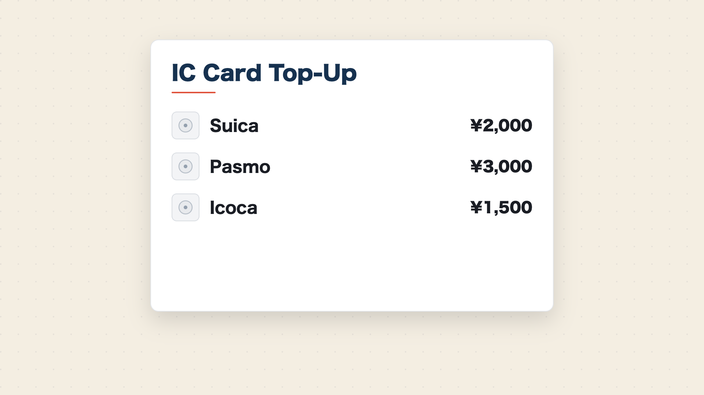
*progressive（段階説明）— 代表レイアウト `card`*

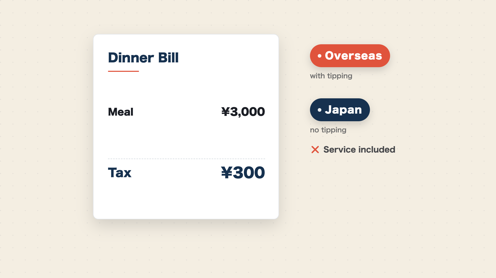
*contrast（対比・否定）— 代表レイアウト `receipt`*

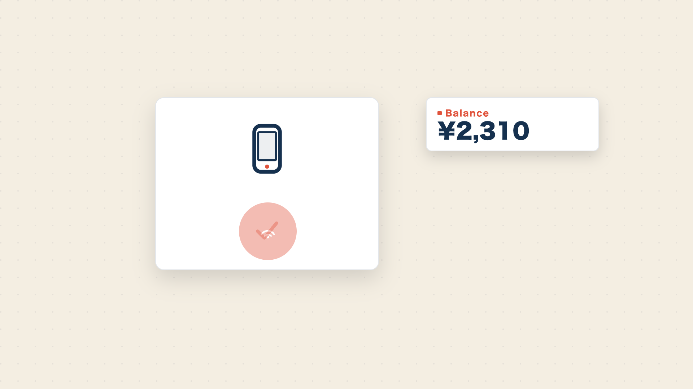
*howto（手順）— 代表レイアウト `generic`*

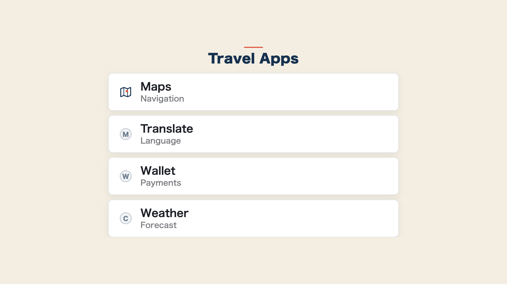
*list（箇条書き）— 代表レイアウト `row`*

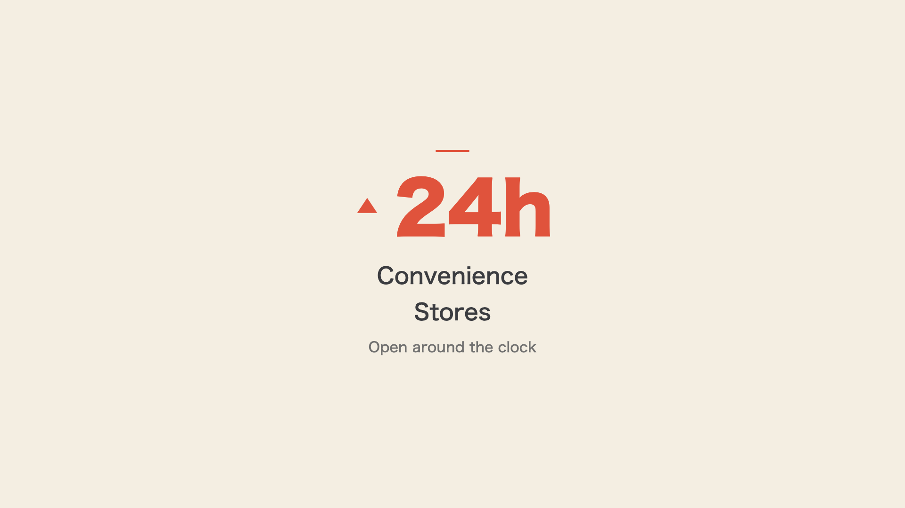
*stat（単一数値の強調）— 代表レイアウト `up`*

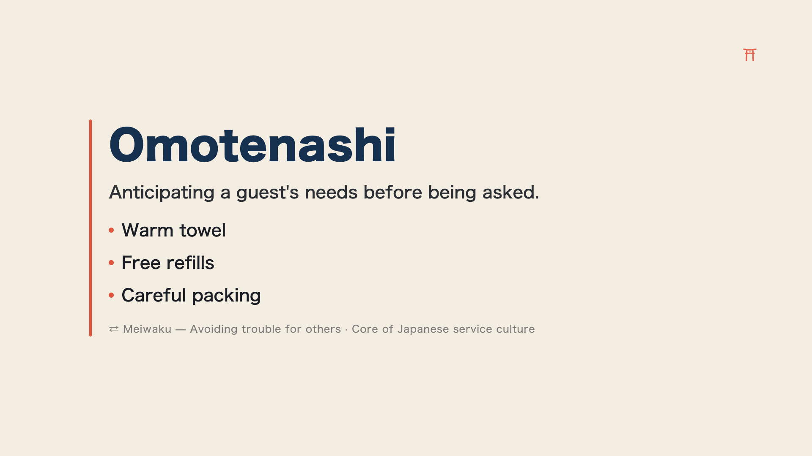
*concept（概念提示）— 代表レイアウト `editorial`*

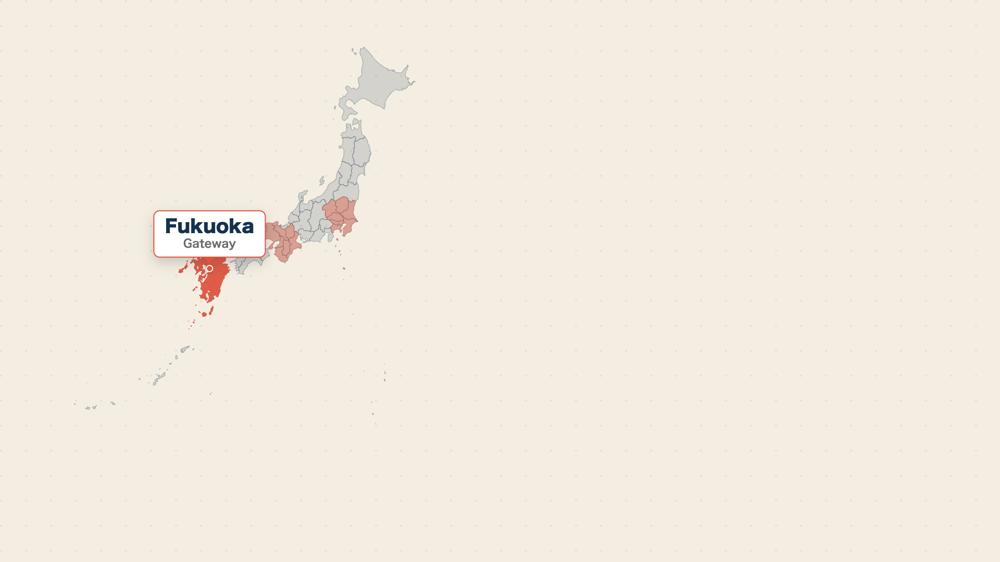
*map（地図・地理差）— 代表レイアウト `japan`*

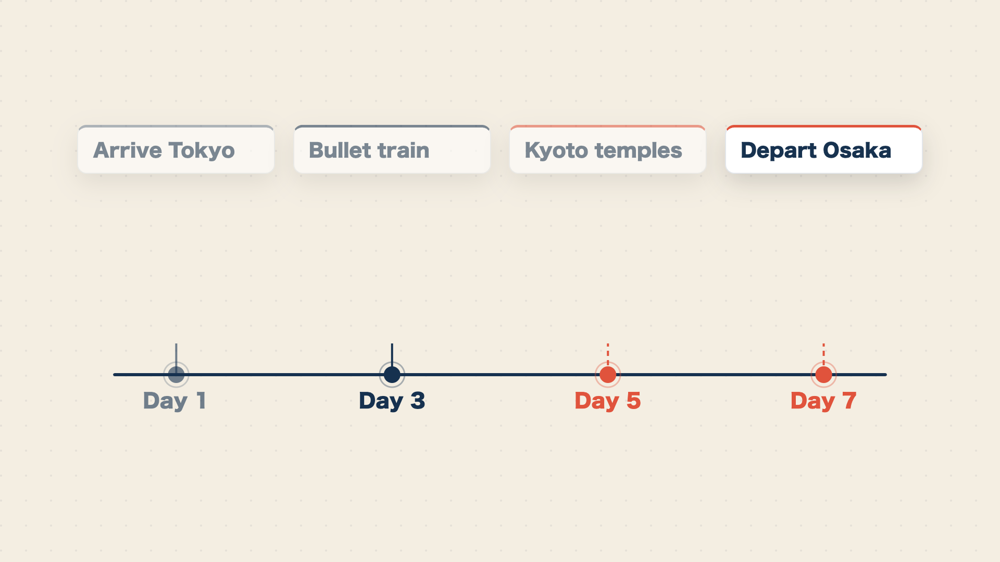
*timeline（時系列）— 代表レイアウト `horizontal`*

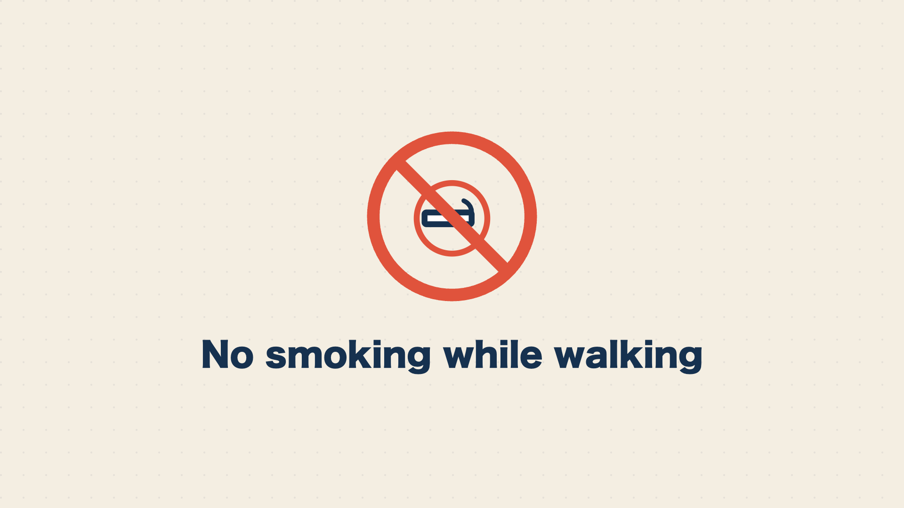
*warning（注意・禁止）— 代表レイアウト `forbid`*

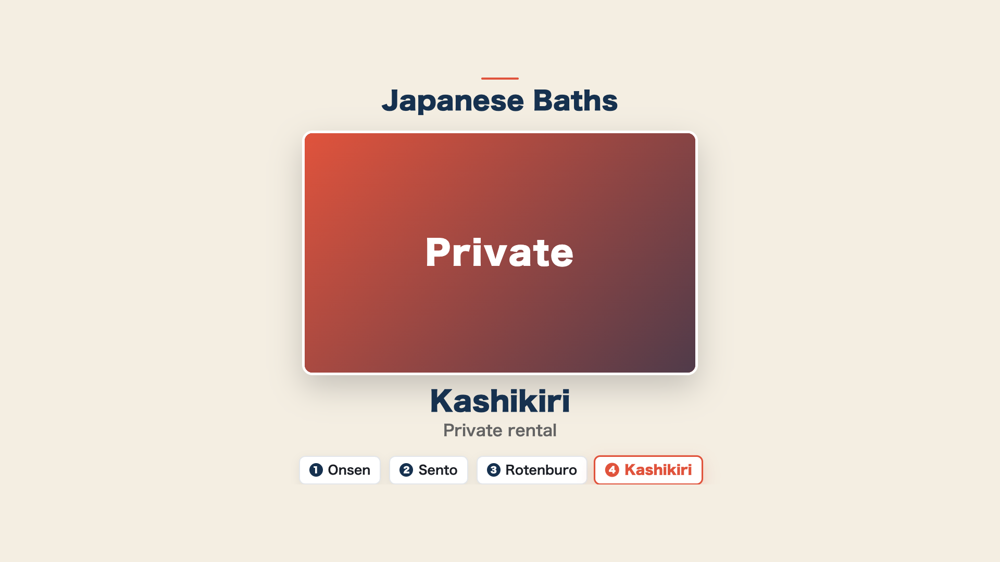
*gallery（写真の連続表示）— レイアウト分岐なし（進捗チップ付き中央フォーカス）*

#### 追加された 8 型

| 型 | 用途 | レイアウト | 写真/動画 |
|---|---|---|---|
| `clip` | 動画クリップ埋め込み（実写動画を主役級に 1 本見せる） | `full` / `caption` / `split` | **動画**（`data.video`） |
| `quote` | 引用（レビュー引用・名言・ユーザーの声） | `centered` / `card` / `with-photo` | 著者写真可（`data.photo`） |
| `versus` | 対称比較（左右対等な 2 対象の属性比較） | `split` / `stacked` / `table` | 左右に写真可（`left.photo` / `right.photo`） |
| `pie` | 構成比（割合・内訳の可視化） | `pie` / `donut` / `callouts` | なし |
| `ranking` | ランキング（人気スポット TOP5・失敗ベスト3） | `list` / `podium` / `countdown` | 各 item に写真可（`items[].photo`） |
| `table` | 比較表（3 対象以上 × 複数属性のマトリクス） | `grid` / `compact` / `highlight` | なし |
| `bar` | 量の比較（月別・地域別・項目別の数量差） | `horizontal` / `vertical` / `ranked` | なし |
| `qa` | 問い→答え（誤解解消・フック・「チップは必要？→不要」） | `single` / `list` / `reveal` | なし |

各型の使いどころは次のとおりです。

- **`clip`（動画クリップ）**: 写真を 1 枚ずつ見せる `gallery` と異なり、実写の**動画そのもの**を再生して主役に立てる型です。`data.video` に動画ファイルを指定します。ここで重要なのは、写真型のように `query` でストックを検索する機能はなく、**ローカル/staticFile（手元の確定ファイル）のみ対応**である点です。動画は「あとで探す」ではなく確定済みのものだけを使うため、台本段階で素材が手元にあることが前提になります。実写は脇役（尺合計の 2〜3 割）の枠内で扱い、ナレーションが指す対象と一致する動画のみを使う事実一致の原則に従います。
- **`quote`（引用）**: レビュー・名言・ユーザーの声など、短い引用文を主役に立てる型です。`with-photo` レイアウトでは著者写真を `data.photo`（確定指定または未確定 `query`）で添えられます。
- **`versus`（対称比較）**: 「東京 vs 大阪」のように左右対等な 2 対象を複数属性で比べる型です。既存の `contrast`（否定／Before-After のような価値判断・時間変化）や `map`（関東 vs 関西のような地理差）とは役割が異なり、`versus` は価値の上下も地理も含まない**対等な属性比較**に使います。3 対象以上を比べたいときは `table` を使います。
- **`pie`（構成比）と `bar`（量の比較）**: いずれも SVG によるデータ可視化系で、互いに対になります。`pie` は割合・内訳の構成比（円グラフ／ドーナツ）、`bar` は数量差（横棒／縦棒）を表します。単一の数値を強調する `stat` とは別物で、複数の値の比較・内訳を見せたいときに使います。写真は使いません。
- **`ranking`（ランキング）**: 「人気スポット TOP5」のような順位付きリストです。`items: [{ rank, label, photo? }]` で記述し、各アイテムに写真を添えられます（`gallery` と同じく確定指定か未確定 `query`）。
- **`table`（比較表）**: 3 対象以上 × 複数属性のマトリクス比較です（2 対象の対称比較は `versus`、順位付けは `ranking`）。`.max` 制約で対象数・属性数を縛り、文字を切り捨てず「器を文字に合わせる」原則を守ります。
- **`qa`（問い→答え）**: 「チップは必要？→不要」のような問い→答え形式で、誤解解消やフック、冒頭で開いた疑問の回収に使います。`reveal` レイアウトでは問いを先に出してから答えを開きます。

##### 後半 8 型の表示サンプル

追加された 8 型の代表レイアウトは次のとおりです（前半 10 型と同じく ai-youtube の実レンダー静止画・nihon101 トンマナ）。


*clip（動画クリップ）— 代表レイアウト `full`*

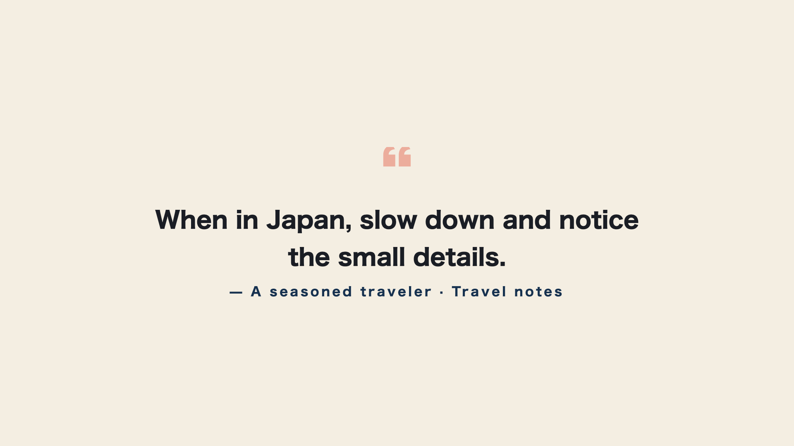
*quote（引用）— 代表レイアウト `centered`*

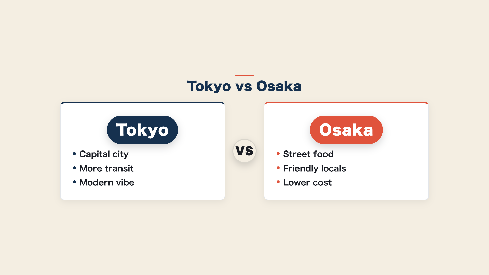
*versus（対称比較）— 代表レイアウト `split`*

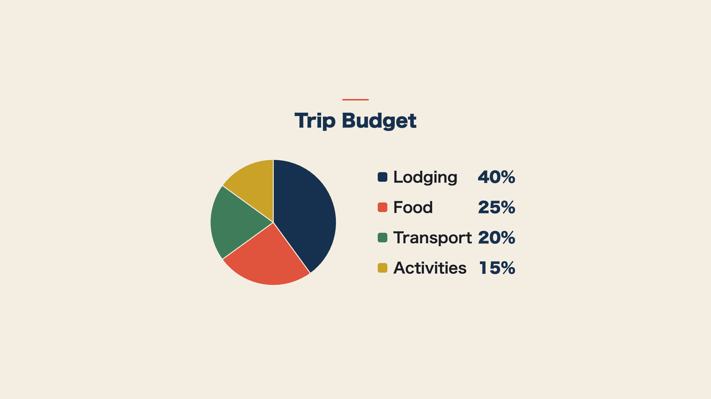
*pie（構成比）— 代表レイアウト `pie`*

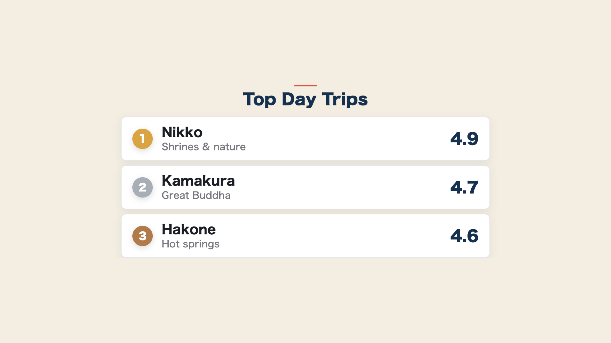
*ranking（ランキング）— 代表レイアウト `list`*

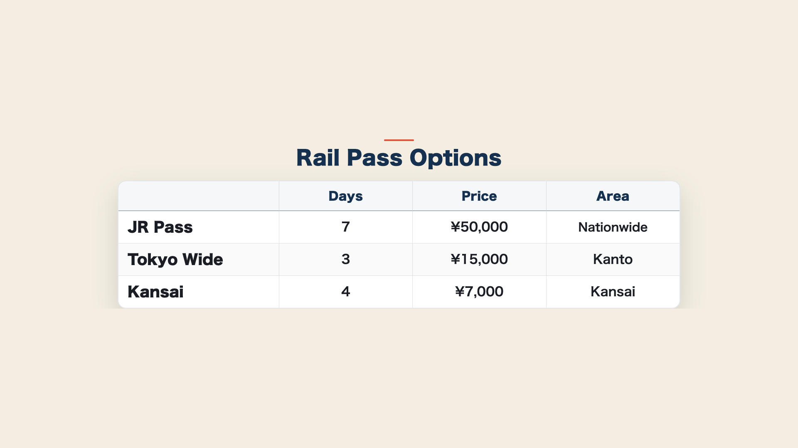
*table（比較表）— 代表レイアウト `grid`*

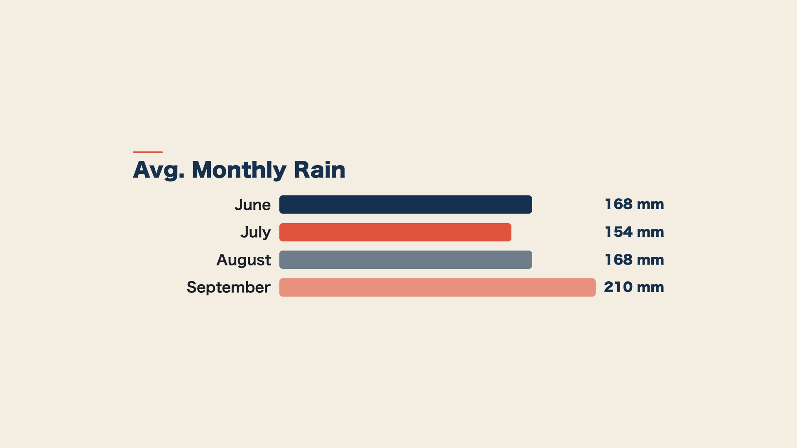
*bar（量の比較）— 代表レイアウト `horizontal`*

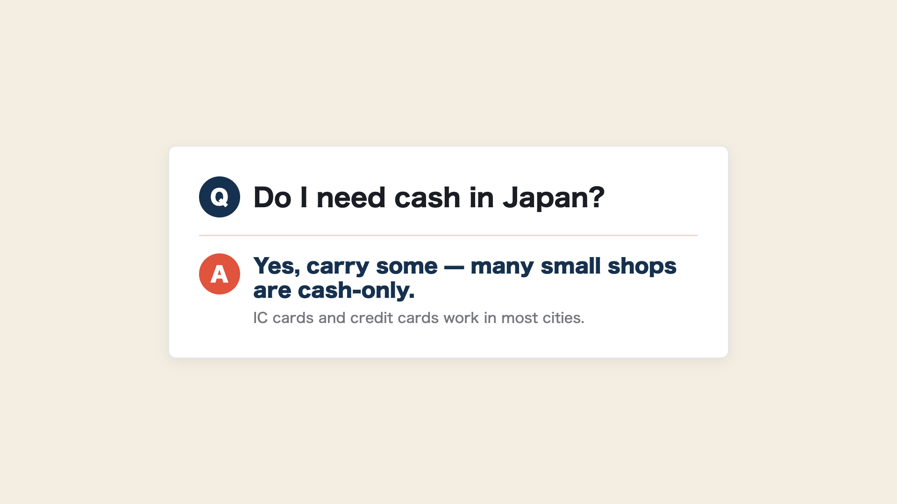
*qa（問い→答え）— 代表レイアウト `single`*

#### figure 型（1 枚図版/確認用）

v1.3.0 で 19 番目の型として `figure`（1 枚図版/確認用フィギュア）が追加されました。型表に並べると次のとおりです。

| 型 | 用途 | レイアウト | 写真/動画 |
|---|---|---|---|
| `figure` | 1 枚図版/確認用（路線図など「全体が見えないと意味がない」図版/写真を 1 枚大きく見せる確認用ショット） | なし（単一表示） | `data.photo` 単一（写真パイプライン注入） |

`figure` は、路線図のように**「全体が見えないと意味がない」図版/写真を、1 枚だけ大きく見せる確認用の型**です。通常の写真は型の中に小窓（ピクチャーイン）で挟むのが原則ですが、`figure` はその**例外**として図版そのものを画面いっぱいに提示します。具体的には**画面の約 80%・中央**に配置し、**白枠＋影**を付け、**`objectFit: contain`（切り抜かない）**で 1 枚を大きく見せます。全体像が欠けると意味を失う図版を、欠けさせずに確認できる形で出すための型だと理解してください。

他の多くの型がレイアウト分岐（`split` や `list` など）を持つのに対し、`figure` は**レイアウトを持たない単一表示型**です。1 枚を中央に出すだけなので、分割や複数配置の分岐は存在しません。データは `data.photo` 単一を写真パイプラインが注入する形で、`title?` / `photo?` / `photoCaption?` の最小構成です。写真の指定方法は他の写真型と同じで、確定 pin（`wikipedia:<記事>` / `commons:<File>` / `file:<名>`）か未確定の `query`（プレビュー承認時に pick して書き戻す）を使います。一致する図版を確定できないときは無理に当てません（誤った写真は写真なしより悪い、という制作原則）。

`figure` を割り当てるかどうかは、**LLM の自動分類でも人手の指定でもどちらでも選べます**。自動で当ててもよいですし、台本作成時に「ここは 1 枚で見せたい」と人が判断して当てても構いません。`figure` も既存型と同じ**不変原則**（情報が主・デザインは従／文字の切り捨て・重なりは禁止／ラベルは英語のみ／焼き込み字幕なし）の上に乗ります。

実際の見た目は次のサンプルのとおりです。

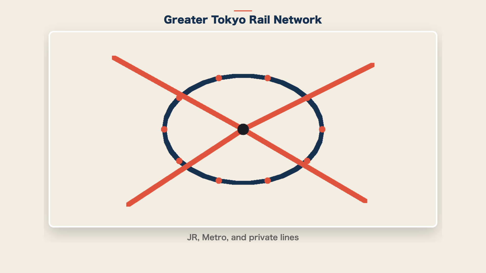
*figure（1 枚図版/確認用）— レイアウト分岐なし（白枠＋影・中央単一表示）*

白枠＋影を付けたカードの中に図版 1 枚を `objectFit: contain`（切り抜かない）で中央表示し、配色は nihon101 のトンマナ（藍・朱・生成り）に揃えています。これは ai-youtube エンジンの実レンダー静止画で、実運用では `photo` に路線図などの実際の図版名を入れると、この器にその図版が 1 枚はめ込まれます。全体像が欠けると意味を失う図版を、欠けさせずに大きく確認できる型だとイメージしてください。

### ③ 縦 Shorts の自動切り出し＋自動アップロード

本編のタイムラインから `hook` / `stat` / `contrast` / `warning` に該当する区間を決定論で抽出し、縦型の YouTube Shorts を自動生成・アップロードする機構です。

- **抽出方式**: 章の役割とテンプレート型を見て機械的に区間を選択します（生成 AI 任せにしません）
- **解像度・尺**: 縦 1080x1920・15〜45 秒。横から縦への変換は安全領域への再配置で行い、末尾に本編へ誘導する CTA カードを付けます
- **メタ**: 説明欄の先頭に本編 URL、タイトルに `#Shorts` を入れます
- **有効化スイッチ**: `channel.yaml` の `upload.shorts_upload`。未設定なら Shorts を作らずアップロードもしません（後方互換）
- **冪等の真実源**: `shorts-manifest.json`（生成済み・アップロード済みを管理。既アップロード分は skip）
- **予約**: `publish_at_offset`（既定 24 時間）だけ本編より後ろにずらして予約公開します（同時露出を避けるため）
- **担当**: 切り出し・縦レンダは `editor`、アップロード・予約は `publisher`（本編が API で成功してから冪等にアップロード）

なお、Shorts を含めるとクォータの都合で実質 1 日 1 本（本編のみなら 1 日 2 本）が目安になります。

### ④ X／TikTok の決定論下書き＋人間ゲート配信

公開済みの本編から X・TikTok 投稿の下書きを決定論で生成し、送信ゲートの手前まで自動で進める機構です。最終的な公開は必ず人間が行います。

- **X**: フック＋本編タイトル＋本編 URL＋ハッシュタグから本文を生成します（280 字厳守）。`social-manifest.json` に下書きとして保存し、実送信は `share-x --send` で行います（最終公開は人間）。有効化スイッチは `social.enabled`、冪等の真実源は `posted`
- **TikTok**: キャプション下書きを生成し、`share-tiktok --send` で inbox（下書き）に送るところまで行います。実際の公開は TikTok アプリで人間が行う二重ゲートです。送信動画は Shorts の `shorts/01.mp4` を前提とし、なければ skip します。有効化スイッチは `social.tiktok.enabled`、冪等の真実源は `tiktok.posted.publishId`
- **担当**: `sns-distributor`（下書き生成と `--send` まで）

Instagram・YouTube Community への展開は従来どおり設計提示のみで、実投稿は人間が行います。

### ⑤ yt-episode 統括フロー（プレビュー承認ゲート＋セクション単位レンダ）

エピソード制作を、台本から公開まで一連のゲート付きフローとして統括する機構です。

```
yt-script
  → 【プレビュー承認（必須・人間ゲート）】 preview.html をユーザーが承認
  → yt-render（セクション単位レンダ）
  → 【ユーザー確認（必須・人間ゲート）】 完成動画をユーザーが確認
  → yt-publish
```

- **章数の自動判定**: 台本 frontmatter の `sections` 配列長で自動判定します（章数を推測しません）
- **セクション単位レンダ**: 60 秒のチャンクに分割し、章（セクション）境界で自動分割します。章ごとに検証し、問題があった章だけ差分再レンダします（全体を一括で焼き直しません）
- **ゲート対応**: ワークフローの `human-picture-lock` → `editor-render` → `publisher` の流れと一致します。プレビュー承認なしにレンダへ、ユーザー確認なしに公開へは進みません
- **担当**: 統括は `director`（正しい順序とゲートで進むよう監督）、レンダは `editor`、公開は `publisher`、承認・確認は人間

### ⑥ update-meta による予約再スケジュール

アップロード済み動画の予約公開日時を、台本の `frontmatter.publish_at` に後から同期する機構です。配信計画を後ろ倒し・前倒しした際に、YouTube 側の予約を合わせます。

- **対象**: `privacy: private`（予約公開待ち）の動画のみ更新し、`public`（既公開）の動画には触れません（公開済み動画の公開日を動かさない）
- **冪等**: すでに `publish_at` と一致していれば何もしません
- **担当**: `publisher`（公開後の運用時のみ・任意）

---

## 新機構（テンプレート v1.4.0）

v1.4.0 で、ai-youtube のサムネ自動化と配信スケジュール表示の知見をもとに 3 つの機構が追加されました。サムネ機構は `channel.yaml` の `upload.thumbnail`（任意）で制御する後方互換の設計で、ブランド名・配色・ロゴはすべて `channel.yaml`（`upload.thumbnail.brand_text` / `video.theme` / `upload.thumbnail.logo`）を参照します（エンジンやエージェントに固有値をハードコードしません）。

### ⑦ サムネイルの自動生成（thumbnail-creator）

台本（hook／keywords／sections）を分析して「クリックされる」サムネイル（1280×720 PNG）を自動設計・生成する機構です。本編とは役割が逆で、本編は「情報を切り捨てない」のに対し、サムネは情報を 3 語前後に削ります。

- **設計三原則**: ①3 語圧縮（見出し＋強調語は理想 2〜4 語・最大 5 語・全大文字。フルセンテンス／本編スライド流用は禁止）／②単一被写体（台本・ナレが指す対象と一致した 1 枚のみ。一致写真が無ければ数字主役かブランドグラデへ。間違った写真は写真なしより悪い）／③好奇心ギャップ（フック・ベネフィット・意外な事実・数字を 1 つ立て、答えの一部を伏せる）
- **4 レイアウト型**: `left-text`（最汎用・ハウツー／解説）／`full-photo-band`（場所・食・風景が主役）／`before-after`（失敗 vs 正解の対比）／`big-number`（数値フック）
- **生成は render 時でなく publish 時**: 台本は公開直前まで改訂が入りうるため、render のたびに作り直さず、写真確定・台本確定後の publish 時に 1 回だけ生成します（無駄なやり直しを避ける）
- **設定**: `channel.yaml upload.thumbnail`（`enabled` 既定 true ／ `brand_text` 既定 = `channel.name` ／ `logo` 任意）。`enabled: false` で従来どおり手動運用に倒せます
- **担当**: サムネ設計（コピー圧縮・レイアウト型選定）は `growth-strategist`、生成は publish 時に `publisher`（`editor` は render まで）

### ⑧ アップロード時のサムネ自動適用

publish の本編アップロード成功後に、生成済みサムネを自動でチャンネルへ反映する機構です。

- **タイミング**: 本編アップロードが API で成功し videoId が確定した直後（localizations より前）に、`output/<ep>/thumbnail.png` があれば `thumbnails.set` で自動適用します（無ければ何もしません）
- **失敗時の挙動**: カスタムサムネ未対応・電話番号未確認チャンネル・スコープ不足などで失敗しても警告にとどめ、本編アップロードは成功扱いとします（字幕 CC・Shorts と同方針）。サムネは後から `set-thumbnail`／`update-meta` で後付けできます
- **単一情報源**: 反映に成功したら `output/<ep>/thumbnail-uploaded`（videoId）を書き、これが「YouTube へ反映済み」の単一情報源になります（配信スケジュール HTML の 🖼️ アイコンがこれを見ます）
- **前提**: カスタムサムネは電話番号確認済みチャンネルのみ設定できます
- **担当**: `publisher`（本編アップロード成功後・冪等）

### ⑨ 配信スケジュール HTML の表示拡張

年間 1 枚の配信スケジュール HTML（単一情報源は月別 plan md の frontmatter `schedule:`）に、工程状態を一目で見せ、閲覧時点の日付で自己更新する表示を追加した機構です。

- **進捗アイコン 4 段階**: 📝 台本レビュー ／ 🎬 動画 ／ ⬆️ アップロード ／ 🖼️ サムネ反映。各段階は `ok`（✓）／`sched`（◷・⬆️ の予約済み）／`partial`（△・サムネ生成済だが未反映）／`wait`（·・待ち）で色分けします。🖼️ は `thumbnail-uploaded` マーカーで点灯します
- **残り日数チップ**: 配信日に `data-deliver`（ISO 日付）を持つ空の器だけを出し、閲覧時に JS が「あと N 日／本日／非表示（過去）」を再計算します
- **動画尺 mm:ss**: `output/<ep>/video.mp4` を ffprobe で測って表示します
- **予約 → 公開の自動反転**: ⬆️ が予約済み（◷）の行は、閲覧時点が公開日を過ぎていれば JS が公開済み（✓）へ反転します
- **静的 HTML に日付を焼き込まない設計**: 「あと N 日」や予約／公開の判定を生成時に固定すると、再生成まで古い値で表示され続けます。これを避けるため、日付依存の表示は属性＋JS で閲覧時に再計算します
- **担当**: `publisher`（配信カレンダーの md＋html 両方を更新）

---

## 新機構（テンプレート v1.5.0）

v1.5.0 で、利益最大化を上流から効かせるために 3 つの変更が入りました。市場・ジャンル戦略エージェント `market-analyst` の新設、視聴を惹きつける台本・タイトル・演出ライティングを方法論化して `scriptwriter`／`growth-strategist` に反映、そしてチャンネル立ち上げワークフローへの上流ステップ追加です。数値は出典・確信度・出典時期を併記し、憶測と事実を区別しています。

### ⑩ 市場・ジャンル戦略エージェント（market-analyst）

`channel-producer`（チャンネルの箱・編成）の**上流**で「何を作るか（どのジャンル・どの角度・どのターゲット視聴国か）」をデータから決める新エージェントです。1 本ごとの CTR を担う `growth-strategist` や公開後の収益最適化を担う `monetizer` とは**別レイヤー**で、最も上流の「土俵選び」を担当します。

中核は**ジャンル選定スコアリングフレーム**です。ジャンル候補を 15〜30 列挙し、次の 7 指標で 0〜3 点に正規化して重み付き合成でスコアリングします。

| 指標 | 意味 | 重み |
|---|---|---|
| `demand` | 月間検索ボリューム／TAM（`10K-100K` が最適帯。ニッチすぎは分母も単価も伸びにくい） | ×1.0 |
| `competition` | 競合の薄さ（「検索多い × 結果 1 万件未満＝供給不足」を一次スクリーニングに） | ×1.5 |
| `cpm` | ジャンル CPM（USD） | ×1.2 |
| **`geo_mix`** | **ターゲット視聴国の英語圏ティア1比率（最優先の横断軸）** | **×1.6** |
| `jp_edge` | 日本人の一次情報優位（差別化防御壁） | ×1.3 |
| `faceless_fit` | 量産適性（顔出し不要か） | ×0.8 |
| `authenticity_risk` | ポリシー抵触（逆スコア・常時減点） | ×1.0 |

`geo_mix`（ターゲット視聴国）を最大重みにした理由は、広告単価が「英語」でなく**視聴者の所在する市場の購買力**で決まるためです。median CPM は米 \$11.95／豪 \$8.93／英 \$7.60／加 \$6.65／日 \$3.41 で、米は日本の約 3.5 倍です（出典: digitalinformationworld 2025-08・確信度: 高。国別の細順位・絶対値は median／average で変わる点は併記します）。日本語コンテンツでも英語圏視聴者比率が高ければ RPM が約 3 倍化しうるため、ターゲット視聴国の選択がジャンル単体の成長性・競合度を上回る収益インパクトを持ちます。

高 CPM ジャンルは金融・保険・法律・不動産・B2B／SaaS が最高帯、ゲーム・エンタメ・vlog が最低帯です（料理・旅行は \$2-4、保険は \$9-20・一部上限 \$50 と幅で扱います。出典: vidIQ／tastyedits 2026・確信度: 中〜高）。日本人の一次情報優位を活かせる領域（訪日旅行・日本語学習・和食・日本での投資）は、海外需要が伸びており（訪日 2025 年 4,268 万人 `+15.8%`／YouTube 旅行カテゴリ 2025 Q2 `+64%`／Duolingo 2025 で日本語が世界 4 位学習言語／アニメ市場 CAGR 9.2%・基準年 2026-2033。確信度: 高）、AI 量産時代の差別化防御壁になります。

競合度の判定は 2 段構えです。机上の一次スクリーニング（結果 1 万件未満＝供給不足）だけでは粗いため、上位候補は**テスト動画 1〜2 本を 2〜4 週運用し、CTR > 4%・視聴維持率 > 50% を満たすか**の実測検証ゲートを併用します。さらに YouTube の inauthentic content ポリシー（2025-07-15 施行・既存ポリシーの明確化・確信度: 高。AI は禁止でなく開示＋人的付加価値が前提で、解説／リアクションは対象外）を `authenticity_risk` として常時減点に組み込み、テンプレ量産を構造的に避けます。**最終ジャンル決定は人間ゲート**で、market-analyst は提案と根拠（スコア内訳・出典・確信度）の提示までを担います。固有のチャンネル名・ブランド名はハードコードせず、`channel.yaml` の地域／言語ターゲットを入力に取る一般化設計です。

### ⑪ 視聴を惹きつける台本・タイトル・演出ライティング（方法論化）

動画タイトル・台本・演出に効く**文体／構成の方法論**を `PRODUCTION-GUIDE.md` §16 に整理し、`scriptwriter`（動画台本）と `growth-strategist`（タイトル・サムネ・章設計）に反映しました。新しい出力物・専用エージェントは作らず、既存の責務に方法論として乗せています。既存の §5（13構造規約・台本の書き方）・§6（視覚型）と整合させ、その上に乗る文体規範です（安全規約は緩めません）。

- **動画タイトル＋フック＋章設計**: タイトルはキャッチコピー（名詞止め・数字を盛らない）。「7選」と言うなら本当に 7 個出す（タイトルの数字と中身を一致＝釣りにしない）。冒頭フックで結論／インパクトを即出しし open loop を張る。章設計は結論→背景→実績→仕組み→具体的やり方→CTA に沿わせる。このタイトル・フック・章設計は `growth-strategist`（サムネ・タイトル）にもそのまま効きます
- **構成（動画の流れ・台本構成）**: 結論／インパクトを冒頭で即出し→背景は軽く→実績→仕組み→具体的やり方→CTA を、動画のタイムライン（台本の節割り）として書く
- **文体（ナレーション／台本）**: 敬語を崩した話し口調・一次情報最優先（自分の経験・数字・失敗談）。離脱させないテンポ（トーンの急ハンドル・短文と余白・視聴者を共犯者に・先回りツッコミ）。数字は対比で見せ自虐で落とす。**太字の多用・イコール記号・根拠なき断言は避ける**。§5（台本構造）と整合
- **ビジュアル（動画内）**: 数値成果は画面で見せる（スクショ的に）／仕組み・フローは図解で可視化／注目箇所を赤枠などで強調。具体の配色・画面テキスト規約は §6（視覚型）に従う

### ⑫ 利益最大化ワークフロー

チャンネル立ち上げ（ジャンル／方向性を新規に決める場合）のワークフローに、`market-analyst` を `channel-producer-setup` の**上流ステップ**として追加しました（`director-planning` の `channel-creation` 分岐 → `market-analyst` → `channel-producer-setup`）。既存のエピソード制作フロー・グロース単発フローは変更していません（ジャンルが確定済みのため market-analyst を通しません）。

加えて、各エージェントの判断に通底する観点として「利益 ≈ CPM × 視聴維持 × 自動化効率 × authenticity」を `PRODUCTION-GUIDE.md` §11 に明文化しました。土俵選び（CPM・ターゲット視聴国）・1 本の最適化（視聴維持）・量産効率（自動化）・ポリシー耐性（authenticity）を同時に効かせる設計です。

---

## 新機構（テンプレート v1.6.0）

v1.6.0 で、ai-youtube の知見をもとに **QA 層（品質ゲート）8 体**と**複数チャンネルのルーティング（チャンネル確定ロジック）**が追加されました。いずれも既存のエピソード制作・チャンネル運用フローに組み込まれる機構で、QA 層は各制作工程の直後に独立した検証ステップとして挿入され、チャンネル確定ロジックは作業対象チャンネルを決定論的に特定します。

### ⑬ QA 層（作った本人とは別の目で検証する品質ゲート）

各制作工程の成果物を、その成果物を作った本人とは別のエージェントが合格基準で照合し、合否を判定する **QA 層 8 体**を追加しました（`PRODUCTION-GUIDE.md` §0.3「作った本人とは別の目で検証する」原則）。各 QA は対応する専用スキル（`yt-script`・`yt-render`・`yt-publish`・`yt-plan-month` 等）または制作憲法の該当セクション・producer 完了条件を「正」とする合格基準で照合し、合格なら次工程へ、不合格なら担当の制作エージェントへ差し戻します。

- **挿入位置**: 各 QA は対応する制作工程の直後に配置されます。たとえば `scriptwriter` → `script-qa` → 次工程、`editor-render` → `render-reviewer` → 人間動画レビュー、`publisher` → `publish-qa` → `sns-distributor`、というように品質ゲートが連なります。
- **8 体の対応工程**: `script-qa`（台本）・`render-reviewer`（レンダ）・`channel-producer-qa`（月次計画・編成）・`growth-qa`（パッケージング）・`affiliate-qa`（アフィリ）・`publish-qa`（公開）・`sns-qa`（SNS 拡散）・`monetizer-qa`（収益施策）。詳細な合否後の遷移は「[エージェント一覧](#エージェント一覧) > QA 層（品質ゲート・8 体）」の表を参照してください。
- **差し戻し上限**: 制作エージェント ↔ QA の差し戻しが繰り返される事態を防ぐため、既存の `rework_limit`（規定回数を超えると `human-escalator` へ遷移）が QA の差し戻しにも適用されます。

QA 層は制作エージェントの「自己検証」を置き換えるものではなく、その外側にもう一段の独立した検証ゲートを設ける設計です。これにより各工程の成果物が次工程へ進む前に、作成者バイアスから独立した合否判定を経ます。

### ⑭ 複数チャンネルのルーティング（チャンネル確定ロジック）

複数のチャンネルを 1 つのリポジトリで運用できるよう、作業対象チャンネルを決定論的に特定する **3 段階のフォールバック方式**を追加しました（`PRODUCTION-GUIDE.md` §0「対象チャンネルの確定」を単一情報源とし、`director`・`channel-producer` の各定義から参照）。`director`（`director-planning` の対象チャンネル確定ステップ）と `channel-producer`（モード判定＋対象チャンネル確定ステップ）が、次の順序で対象チャンネルを確定します。

1. **① エピソード参照（自己確定）**: Issue 本文・引数・コメント内に `channels/<id>/episodes/...` のパス、または対象 `.md` の frontmatter に `channel:` フィールドがある場合、その `<id>` を対象チャンネルに確定します。この段階で確定したら ②③ はスキップします。
2. **② `channel:` ラベル**: ① で確定できない場合、Issue に付与された `channel:<id>` ラベルから確定します。`gh issue view <番号> --json labels` で `channel:` プレフィックスのラベルを機械抽出し、プレフィックスを除いた値 `<id>` を対象チャンネルとします（決定論的・複数付与で一意化できない場合は ③ へ）。
3. **③ `missing_channel` エスカレーション**: ①② のいずれでも確定できない場合、`missing_channel` で人間に「どのチャンネルで作業するか」を問います（`human-escalator` へ遷移・`escalated:human` ラベルへ更新）。

`missing_channel` は **YouTube チーム内に閉じたエスカレーション種別**で、共有の `escalation-rules.yml`（`_shared`）には定義しません（backend／sns 等の他チームへ伝播させないため）。チャンネルスコープは `channel:<id>` ラベル（値は `channels/<id>/` のディレクトリ名）で表され、特定のチャンネル名やチャンネル ID をテンプレートにハードコードしません。

---

## DOD（Definition of Done）

| ファイル | 用途 | 新機構に関する主なチェック項目 |
|---------|------|---------------------------|
| `dod/channel-creation.md` | チャンネル立ち上げ | （ジャンル／方向性を新規に決める場合）market-analyst が geo_mix を最優先軸に 7 指標でスコアリングし、実測ゲート（CTR>4%・視聴維持率>50%）併用・authenticity_risk 組込・出典／確信度付きの推奨 3 案を提示し、最終ジャンル決定が人間ゲートであること。Shorts／X／TikTok の各有効化スイッチ（`upload.shorts_upload`・`social.enabled`・`social.tiktok.enabled`）を使う場合のみ設定済みであること（未設定なら動作しない）。多言語メタが `subtitles.targets` 駆動であることの把握 |
| `dod/episode-production.md` | エピソード制作 | 多言語メタの冪等投入。プレビュー承認ゲート（人間ゲート）の通過。サムネ自動生成・自動反映（`thumbnail-uploaded` 確認・有効チャンネルのみ）。縦 Shorts・X・TikTok 配信が有効チャンネルのみ規定どおり実行されていること |
| `dod/growth.md` | グロース | Shorts／切り抜き案が根拠付きで提示されていること。X／TikTok 配信が `--send`（下書き・inbox 送信）まで提示され、最終公開が人間ゲートであること |

---

## このチームを使うとき

- どのジャンル・どのターゲット視聴国で勝負するかを需要×競合×CPM のデータで決めたい（market-analyst）
- YouTube 動画の企画・台本作成から生成・公開までを一貫して進めたい
- タイトル・説明欄を多言語化してグローバルな視聴者にリーチしたい
- 本編から縦型 Shorts を自動で切り出してアップロードしたい
- X・TikTok への配信を、人間の承認を挟んだうえで運用したい
- アフィリエイトや収益化を意識した動画運用をしたい

導入は `/ai-team-install youtube` で行います。詳細は [ai-team-install](../skills/install.html) と [チーム概要](overview.html) を参照してください。
