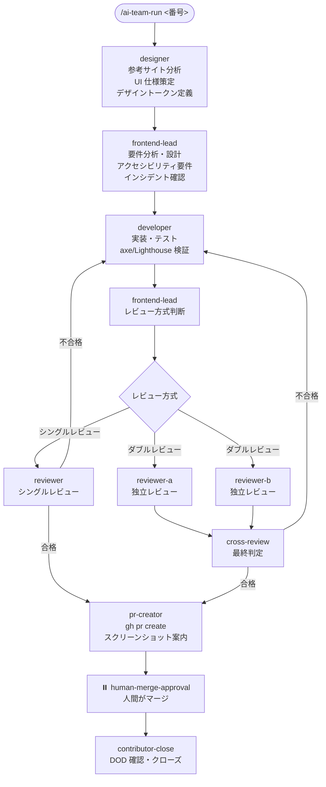

# フロントエンドチーム

フロントエンドチームは、UI 設計・コンポーネント実装・アクセシビリティ対応・PR 作成までを自律的に行う AI チームです。バックエンドチームと同様にシングル / ダブルレビューを自動で使い分けますが、最初のステップに「Designer」エージェントが追加されている点が特徴です。

ワークフローの最初のステップが `designer-analysis` であるため、チケットにワークフローを起動させるためのラベルは **`frontend:designer`** です（v0.23.0 で `frontend:frontend-lead` から統一。キーワード判定表・ソロモードの `target_labels`・Dispatcher の割り当ても同様）。`frontend:frontend-lead` は Frontend-Lead が担当する中間ステップのラベルとして引き続き使われます。

> **ワークフロー定義**: `.claude/teams/frontend/workflow.yml`
> **レビュー判定**: `.claude/teams/frontend/review-config.yml`
> **エージェント定義**: `.claude/teams/frontend/agents/*.md`
> **DOD テンプレート**: `.claude/teams/frontend/dod/*.md`

---

## エージェント一覧

| エージェント | 役割 | ラベル |
|------------|------|--------|
| `designer` | デザイン担当。参考サイト分析・UI 仕様策定・デザイントークン定義 | `frontend:designer` |
| `frontend-lead` | リーダー。要件分析・コンポーネント設計・アクセシビリティ要件確認・レビュー方式判断 | `frontend:frontend-lead` |
| `developer` | 実装担当。コンポーネント・ページの実装 | `frontend:developer` |
| `reviewer` | シングルレビュー担当 | `frontend:reviewer` |
| `reviewer-a` | ダブルレビュー A 担当 | `frontend:reviewer-a` |
| `reviewer-b` | ダブルレビュー B 担当 | `frontend:reviewer-b` |
| `pr-creator` | プルリクエスト作成担当 | `frontend:pr-creator` |

---

## ワークフロー全体フロー



バックエンドとの違い：

- **Designer ステップが最初に追加**: 参考サイト・UI 仕様を策定してから設計に入る
- **Tech-Writer が存在しない**: フロントエンドにはドキュメント自動更新ステップなし
- **PR にスクリーンショット添付の案内**: PR-Creator が PR 本文と チケットコメントで案内

---

## Designer エージェントの動作

社内にデザイナーがいないことを前提に、チケットに記載された参考サイト・既存画面・要件から UI 仕様を策定します。コードは書きません。

### 入力

チケット本文から以下を収集：

- 参考サイト URL
- 画像・既存画面のスクリーンショット
- 要件記述

参考資料がない場合は チケットコメントで補足情報を人間に確認します（推測で進めない）。

### 出力（UI 仕様コメント）

- レイアウト（グリッド・カラム数・余白ルール）
- カラースキーム（WCAG コントラスト確認付き）
- タイポグラフィ
- コンポーネント構成
- インタラクション
- レスポンシブ挙動
- アクセシビリティ調整

### アクセシビリティ基準

WCAG 2.1 AA を基準として以下を確認：

- コントラスト比: テキスト 4.5:1 以上、大テキスト 3:1 以上
- フォントサイズ: 本文 16px 以上推奨
- タッチターゲットサイズ: 44×44px 以上

---

## レビュー方式の自動判断

Frontend-Lead が Developer の完了報告を確認した後、`.claude/teams/frontend/review-config.yml` の `double_review_criteria` に基づいて判断します。

### ダブルレビュー判定基準（いずれか 1 つでも該当）

| 基準 | しきい値 |
|------|---------|
| 変更ファイル数 | 5 ファイル以上 |
| 認証 UI | login / auth / session に関わる変更 |
| 決済 UI | payment / checkout / billing に関わる変更 |
| 個人情報フォーム | user / profile / password に関わる変更 |
| デザインシステム破壊的変更 | 共通コンポーネント・スタイル変数・テーマの変更 |
| 公開 API インターフェース変更 | リクエスト・レスポンスの型変更・エンドポイント変更 |
| 危険ラベル | `complexity:high` / `security-sensitive` / `breaking-change` |

### シングルレビュー判定基準

- 単一コンポーネントの軽微な変更
- ドキュメント・コメントのみの変更
- テストの追加（実装ロジックの変更なし）
- スタイル・フォーマットの修正
- 静的なコンテンツ（テキスト・画像）の変更

---

## レビュー観点（フロントエンド固有）

`reviewer` / `reviewer-a` / `reviewer-b` は以下を確認します。

### コード品質
- 変数名・関数名の表現力
- 1 コンポーネント・1 関数が単一責務
- 重複排除

### アクセシビリティ（WCAG 2.1 AA は CRITICAL 扱い）
- ARIA 属性（role・aria-label・aria-describedby 等）
- キーボード操作性（フォーカス管理・フォーカストラップ・復元）
- コントラスト比

### パフォーマンス
- 不要な再レンダリングの不在
- バンドルサイズ（大きなライブラリの不必要なインポート）
- 画像最適化（形式・サイズ・遅延読み込み）
- Core Web Vitals（LCP・INP・CLS）

### セキュリティ
- XSS（dangerouslySetInnerHTML の不適切な使用なし）
- CSP 違反なし
- 外部リソースの適切管理

### その他
- ブラウザ互換性
- レスポンシブ（モバイル・タブレット・デスクトップ）
- デザインシステム準拠

**アクセシビリティ違反は CRITICAL 扱い**となり、1 件でもあれば不合格判定です。

---

## PR 作成（フロントエンド固有要素）

`pr-creator` は PR 本文に以下を含めます（v0.30.0 から、人が承認判断に使う部分だけを表示し、残りは話題ごとの `<details>` に折りたたみます）。

```markdown
## 概要
...

## 承認前に知っておくこと
- **差分の読み方**: ...
- **既存環境への影響**: ...
- **検証**: <実行したコマンドと結果。CI・リントが無いときは「無し」と書き、代わりに行った確認を書く>

## スクリーンショット
> 実装した UI のスクリーンショットをこちらに添付してください
> - モバイル表示
> - タブレット表示
> - デスクトップ表示

<details>
<summary>アクセシビリティ対応</summary>

- WCAG 2.1 AA 対応内容: ...
- ARIA 属性・キーボード操作: ...

</details>

## チェックリスト
- [ ] セルフレビュー完了
- [ ] レビュアーの承認済み
- [ ] アクセシビリティ検証済み
- [ ] レスポンシブデザイン確認済み
```

上の例のほかに、変更ファイルの内訳・設計方針・テストとレビューの詳細も、それぞれ `<details>` に入れます。`**検証**:` 行と `## テスト` には、実行したコマンドと結果だけを書きます。

PR 作成時の チケットコメントでも、スクリーンショット添付を必ず案内します。

---

## DOD（Definition of Done）

| ファイル | 用途 | 主なチェック項目 |
|---------|------|---------------|
| `dod/feature.md` | 新機能実装 | 設計方針・実装・WCAG・レスポンシブ・パフォーマンス・テスト・PR スクリーンショット |
| `dod/component.md` | 新規コンポーネント作成 | Props 設計・再利用性・アクセシビリティ・ドキュメント（Storybook 等） |
| `dod/bugfix.md` | バグ修正 | 再現手順・根本原因・リグレッションテスト |

---

## ステップ定義詳細（workflow.yml より）

| step id | agent | label | 概要 |
|---------|-------|-------|------|
| `designer-analysis` | designer | `frontend:designer` | 参考サイト分析・UI 仕様策定・デザイントークン定義 |
| `frontend-lead-analysis` | frontend-lead | `frontend:frontend-lead` | 要件分析・設計・アクセシビリティ要件 |
| `developer` | developer | `frontend:developer` | 実装・テスト |
| `frontend-lead-review-decision` | frontend-lead | `frontend:frontend-lead` | レビュー方式判断 |
| `reviewer` | reviewer | `frontend:reviewer` | シングルレビュー |
| `reviewer-a` / `reviewer-b` | reviewer-a / reviewer-b | `frontend:reviewer-a/b` | 独立並列レビュー |
| `cross-review` | reviewer-a | - | クロスレビュー |
| `pr-creator` | pr-creator | `frontend:pr-creator` | PR 作成 |
| `human-merge-approval` | human-escalator | `escalated:human` | 人間がマージ |
| `human-escalator` | human-escalator | `escalated:human` | エスカレーション |
| `contributor-close` | contributor | `contributor:ready` | DOD 確認・クローズ |

---

## 関連ドキュメント

- [チーム概要](overview.html) — 全チームの比較
- [ワークフロー定義](../reference/workflow.html) — workflow.yml の文法
- [DOD テンプレート](../reference/dod.html) — DOD の運用ルール
