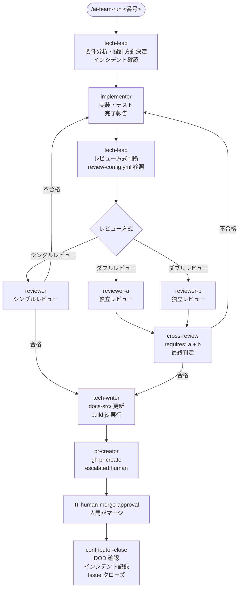

# バックエンドチーム

バックエンドチームは、コード実装・テスト・レビュー・ドキュメント更新・PR 作成までを自律的に行う AI チームです。実装内容の影響範囲に応じて、シングルレビュー / ダブルレビューを自動で使い分ける仕組みが特徴です。

> **ワークフロー定義**: `.claude/teams/backend/workflow.yml`
> **レビュー判定**: `.claude/teams/backend/review-config.yml`
> **エージェント定義**: `.claude/teams/backend/agents/*.md`
> **DOD テンプレート**: `.claude/teams/backend/dod/*.md`

---

## エージェント一覧

| エージェント | 役割 | ラベル |
|------------|------|--------|
| `tech-lead` | リーダー。要件分析・設計方針決定・レビュー方式判断 | `backend:tech-lead` |
| `implementer` | 実装担当。Tech-Lead の方針に従いコード・テストを実装 | `backend:implementer` |
| `reviewer` | シングルレビュー担当 | `backend:reviewer` |
| `reviewer-a` | ダブルレビュー A 担当（独立レビュー + クロスレビュー） | `backend:reviewer-a` |
| `reviewer-b` | ダブルレビュー B 担当（独立レビュー + クロスレビュー） | `backend:reviewer-b` |
| `tech-writer` | ドキュメント更新担当。`docs-src/` 更新と `build.js` 実行 | `backend:tech-writer` |
| `pr-creator` | プルリクエスト作成担当 | `backend:pr-creator` |

各エージェントの詳細は各 agents/ ページを参照してください。

---

## ワークフロー全体フロー



---

## レビュー方式の自動判断

Tech-Lead が Implementer の完了報告を確認した後、`.claude/teams/backend/review-config.yml` の `double_review_criteria` に基づいてレビュー方式を判断します。

### ダブルレビュー判定基準（いずれか 1 つでも該当）

| 基準 | しきい値 |
|------|---------|
| 変更ファイル数 | 5 ファイル以上 |
| 機密領域への変更 | 認証・認可・決済・個人情報・DB スキーマ・公開 API・セキュリティ設定 |
| クロスレイヤー変更 | DB / API / Frontend の複数レイヤーにまたがる |
| 危険ラベル | `complexity:high` / `security-sensitive` / `breaking-change` |

### シングルレビュー判定基準（すべてに該当）

- 単一ファイルの変更
- ドキュメント・コメントのみの変更
- テストの追加（実装ロジックの変更なし）
- 設定値・定数の変更（アルゴリズムの変更なし）
- スタイル・フォーマットの修正

### 機密領域の判定キーワード

`review-config.yml` の `sensitive_areas` で定義：

| 領域 | キーワード |
|------|----------|
| 認証・認可 | auth / login / session / token / JWT |
| 決済・課金 | payment / billing / stripe / invoice |
| 個人情報 | user / password / email / PII |
| DB スキーマ | migration / schema |
| 公開 API | エンドポイントの追加・削除・破壊的変更 |
| セキュリティ設定 | cors / csrf / rate-limit / firewall |

---

## ダブルレビューの仕組み

ダブルレビューは「独立レビュー → クロスレビュー」の 2 段階で行われます。

### 段階 1: 独立レビュー（並列実行）

```
reviewer-a と reviewer-b が並列起動
  - お互いのコメントは読まない
  - それぞれが Tech-Lead の方針と Implementer の実装をレビュー
  - 暫定判定コメントを投稿
```

各レビュアーは Reviewer-A / Reviewer-B として独立して動作し、`workflow.yml` の `parallel_with` 設定で並列実行が宣言されています。

### 段階 2: クロスレビュー

```
両者完了後、reviewer-a がクロスレビューをリード
  - requires: [reviewer-a, reviewer-b] で両者完了を待つ
  - 指摘の差異を比較・議論
  - 最終判定（合格 / 不合格 / エスカレーション）を投稿
```

両者の意見が割れて判断できない場合は `human-escalator` を呼び出します。

---

## レビュー結果による分岐

レビューの結果に応じて次のステップが決まります。

| 結果 | 次のステップ |
|------|------------|
| 合格 | `tech-writer` |
| 不合格 | `implementer`（差し戻し、`on_rework`） |
| 意見不一致（ダブルレビュー） | `human-escalator` |

---

## Tech-Writer のドキュメント更新

レビュー合格後、Tech-Writer が起動してドキュメントを更新します。詳細は [Tech-Writer エージェント詳細](../agents/tech-writer.html) を参照してください。

主な処理：

1. `git diff` で変更差分を取得
2. `package.json` からバージョンを読み取り、`docs-src/versions/v<バージョン>/` を準備
3. Markdown を更新
4. `node docs-src/build.js` を実行して HTML をビルド
5. `docs-src/` と `public/docs/` を 1 つのコミットに含める

---

## PR 作成と人間マージ

Tech-Writer 完了後、PR-Creator が起動します。

```bash
gh pr create \
  --title "<タイトル>" \
  --body "<本文>" \
  --base main \
  --head <feature-branch>
```

PR 本文には次が含まれます：

- 概要・関連 Issue（`Closes #<番号>`）
- 変更内容（Implementer の完了報告から転記）
- 設計方針（Tech-Lead の方針から要約）
- テスト結果
- レビュー結果
- チェックリスト

PR 作成後は `escalated:human` ラベルが付与され、人間のマージを待ちます。マージは AI ではなく必ず人間が行います。

---

## DOD（Definition of Done）

バックエンドチーム用に 5 種類の DOD テンプレートが用意されています。

| ファイル | 用途 | 主なチェック項目 |
|---------|------|---------------|
| `dod/feature.md` | 新機能実装 | 設計方針・実装・テスト・カバレッジ 80%・レビュー・PR・ドキュメント |
| `dod/bugfix.md` | バグ修正 | 再現手順・根本原因・リグレッションテスト・同種バグ確認・PR |
| `dod/refactor.md` | リファクタリング | 目的明記・機能変更なし・カバレッジ維持・PR |
| `dod/review.md` | コードレビュー | スコープ・重大度別整理・レビュー方式判断・全件対応 |
| `dod/documentation.md` | ドキュメント更新（Tech-Writer 用） | 全変更箇所反映・バージョン管理・ビルド成功・コミット形式 |

`contributor` エージェントが Issue クローズ前に該当 DOD の全項目チェックを実施します。

---

## ステップ定義詳細（workflow.yml より）

`.claude/teams/backend/workflow.yml` の主要ステップ：

| step id | agent | label | 概要 |
|---------|-------|-------|------|
| `tech-lead-analysis` | tech-lead | `backend:tech-lead` | 要件分析・設計方針決定・インシデント確認 |
| `implementer` | implementer | `backend:implementer` | 実装・テスト実施 |
| `tech-lead-review-decision` | tech-lead | `backend:tech-lead` | レビュー方式を `conditions` で分岐判定 |
| `reviewer` | reviewer | `backend:reviewer` | シングルレビュー |
| `reviewer-a` | reviewer-a | `backend:reviewer-a` | ダブルレビュー A（`parallel_with: reviewer-b`） |
| `reviewer-b` | reviewer-b | `backend:reviewer-b` | ダブルレビュー B（`parallel_with: reviewer-a`） |
| `cross-review` | reviewer-a | `backend:reviewer-a` | クロスレビュー（`requires: [reviewer-a, reviewer-b]`） |
| `tech-writer` | tech-writer | `backend:tech-writer` | docs-src 更新・build.js 実行 |
| `pr-creator` | pr-creator | `backend:pr-creator` | PR 作成・人間に承認依頼 |
| `human-merge-approval` | human-escalator | `escalated:human` | 人間がマージ |
| `human-escalator` | human-escalator | `escalated:human` | 判断不能事項を人間にエスカレーション |
| `contributor-close` | contributor | `contributor:ready` | DOD 確認・Issue クローズ（`action: close_issue`） |

---

## 関連ドキュメント

- [Tech-Writer](../agents/tech-writer.html) — ドキュメント更新の詳細
- [ワークフロー定義](../reference/workflow.html) — workflow.yml の文法
- [DOD テンプレート](../reference/dod.html) — DOD の運用ルール
